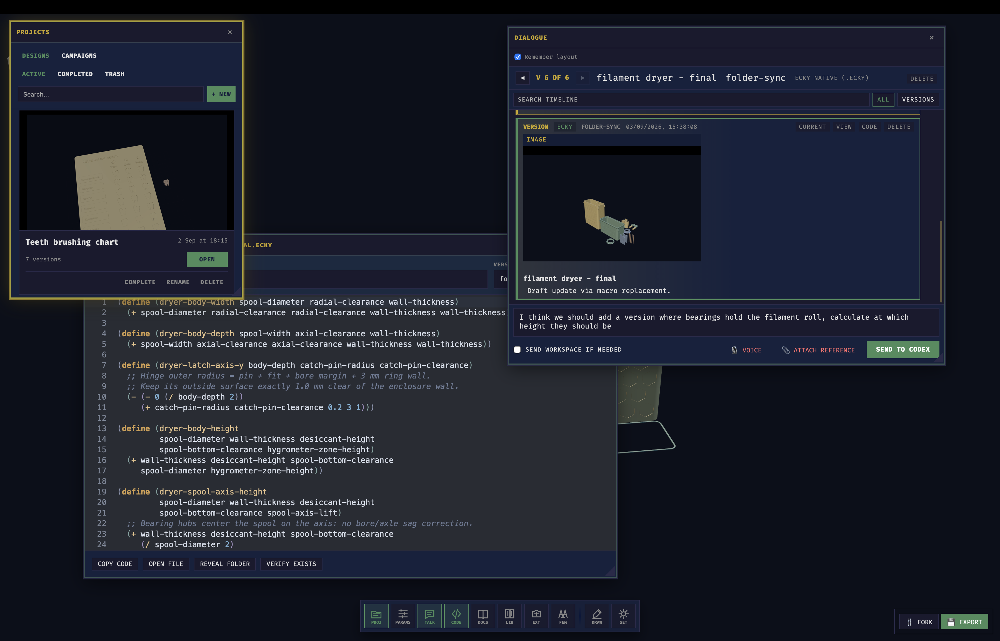

# Ecky CAD

Ecky is an experimental desktop application for building parametric 3D parts from code, with optional AI assistance. It brings projects, a source editor, a 3D viewport, parameter controls, and conversation and version history into one workspace. You can work manually, use an API provider, connect Codex inside Ecky, or bring an external MCP agent.

Models are stored as `.ecky` source: a small modeling language with Lisp-style syntax. You can write it yourself, ask a model to generate it, or let an external agent edit it through MCP. The native geometry backend uses Open CASCADE Technology (OCCT); supported models can be exported as STEP or STL.

The project is at **0.0.1** and under active development. Expect to build from source, encounter bugs, and see changes to the language and APIs.

[Modeling tutorial](public/tutorials/ecky-campaign.md) · [Language reference](public/docs/ecky-ir.md) · [Website and examples](https://ecky-cad.com/)



*The desktop workbench: projects, source, model preview, and conversation share a rearrangeable window layout.*

## How it started

I bought a 3D printer, and making parts gradually turned into building the software to model them. The first version of Ecky asked an LLM to write FreeCAD Python macros, ran them, and displayed the result. It was a way to try a description, see what came out, and make another attempt.

That experiment kept acquiring tools around it: parameter controls, editable source, screenshots for feedback, version history, and design forks. Eventually, the model description became a project of its own. Ecky gained a Lisp-style language, a compiler, explicit geometry operations, and checks written alongside the model. The rendering path evolved too, through work with FreeCAD and Build123d to direct OCCT execution.

So a printer purchase ended up involving a desktop application, a small programming language, and a CAD runtime. Each of those now brings its own problems to work on. That is where the project stands: an ongoing personal experiment whose scope has grown well beyond its starting point. The everyday loop remains simple — describe or write a part, inspect it, change it, and try again.

## Working with a model

A project keeps its source, conversation, and model versions together. The usual loop is to edit or describe a part, inspect the result, adjust dimensions, and export the geometry.

- **Edit source or controls.** Write `.ecky` in the workbench or open the project's `model.ecky` in an external editor. Saved file changes are picked up automatically; source parameters become workbench controls.
- **Use Codex from Dialogue.** Select the Codex provider in settings and send prompts from Ecky. Each project keeps its attached Codex conversation and queued requests. Completed replies remain in the local history.
- **Choose another connection.** API adapters support Gemini, OpenAI-compatible endpoints, and Ollama. The local MCP server lets external agents inspect the current project, edit its bound source file, render, and verify results.
- **Keep revisions and evidence.** Changed drafts become versions before validation and rendering. Failed revisions stay in history with their errors; successful previews can carry structural checks and authored `verify` results. There is no separate model commit or promotion step.
- **Organize and inspect.** Browse active, completed, and deleted projects; search conversation history or show only versions. Inspect source and previews, return to another version, or fork a design.
- **Export the current result.** Save STL for slicing and STEP when the current geometry has a STEP artifact. Export availability comes from the rendered model.

Source, settings, and history are stored locally. Manual authoring does not require an AI provider. Remote AI connections receive the context needed for the request, which can include source, conversation, attachments, and viewport images.

For a concrete example, the repository contains a [bicycle bottle holder](sites/landing/src/models/bicycle-bottle-holder.ecky) and a separate [frame mount rail](sites/landing/src/models/bottle-holder-frame-mount-rail.ecky). Their source includes dimensions for the bottle, frame, walls, and dovetail connection. These are modeling examples; the files alone do not establish physical fit.

## The model source

Save this as `model.ecky`:

```scheme
(model
  (params
    (number radius 10mm :label "Radius" :min 1 :max 40 :step 1))

  (part body
    (sphere radius)))
```

This defines a sphere and exposes its radius as a parameter. More involved models use profiles, extrusions, boolean operations, placements, repeated geometry, and reusable components. Models can also declare `verify` checks for requirements that the application can measure.

The source compiles to an intermediate representation before geometry is built. `.ecky` has a defined modeling vocabulary; it does not expose the entire OCCT API or run arbitrary Python. See the [language reference](public/docs/ecky-ir.md) for supported forms and the [tutorial](public/tutorials/ecky-campaign.md) for worked models.

## Running from source

The desktop application uses Tauri, Rust, Svelte, and Three.js. The runtime preparation and native runner scripts support macOS and Linux, including platform-specific library paths.

You need:

- Node.js/npm, Rust/Cargo, and the platform build dependencies for Tauri 2.
- C and C++ compilers, CMake, and Python 3 with `venv` and `pip`.
- An installed OCCT SDK, including headers and libraries. The preparation script discovers Homebrew's `opencascade`, or accepts `ECKY_OCCT_SOURCE_ROOT` pointing to a directory containing `include/opencascade` and `lib`.
- The shell utilities used by the preparation scripts, including `curl`, `rsync`, and `shasum`.

From the repository root:

```bash
npm install
bash scripts/prepare_manifold_runtime.sh
npm run runtimes:prepare
npm run tauri dev
```

Run Manifold preparation first: it downloads and builds the mesh library required by the native runner. `runtimes:prepare` copies the installed OCCT SDK into the local runtime bundle, builds the runner, and prepares the Python speech client. It does not install OCCT itself. See the [OCCT](scripts/prepare_occt_runtime.sh), [Manifold](scripts/prepare_manifold_runtime.sh), and [speech](scripts/prepare_speech_runtime.sh) scripts for paths and overrides.

Open settings to choose an API, MCP, or Codex connection if you want AI assistance. FreeCAD is optional for native `.ecky` modeling, but required for its own backend, FCStd import, and STEP/FCStd imports from the FreeCAD library. Configure its command path in settings or use an installation the app can discover.

`npm run dev` starts the Vite frontend and Node server. Use `npm run tauri dev` for the desktop application.

Settings are stored in the platform app-config directory as `config.edn`. The older `config.json` format is accepted for import only.

### Command line

The repository also includes an `ecky` CLI for checking and rendering source. After preparing the runtimes, build it from the repository root:

```bash
cargo build --manifest-path src-tauri/Cargo.toml --features cli --bin ecky
```

Using `model.ecky` from the example above:

```bash
src-tauri/target/debug/ecky check model.ecky
src-tauri/target/debug/ecky render --backend native model.ecky \
  --param radius=12 --stl model.stl --step model.step --json
```

`check` compiles the source without rendering. `render` builds the requested artifact. The CLI also supports lowering to FreeCAD source and rendering through FreeCAD; its [entry point](src-tauri/src/bin/ecky.rs) contains the command syntax.

## Limitations

Generated source can be wrong, supported operations can fail on particular geometry, and changing a dimension can break a model. A successful render means the backend produced an artifact. A passing `verify` result covers the checks that were declared, not every property of the design.

STEP availability depends on the geometry path; mesh-based results do not necessarily have a STEP export. Examples and previews do not prove that a part fits, carries a load, or prints successfully. Those still need measurements and physical testing.

## Documentation and development

- [Modeling tutorial](public/tutorials/ecky-campaign.md) — worked examples, starting with a bracket.
- [Language reference](public/docs/ecky-ir.md) — syntax and modeling operations.
- [MCP tool reference](skills/ecky-mcp/reference/tools.md) — external-agent integration.
- [VS Code extension](editors/vscode/README.md) and [Emacs mode](editors/emacs/README.md) — editor support.
- [Agent and contributor protocol](AGENTS.md) — ownership boundaries, coding conventions, and verification rules.
- [OpenSpec changes](openspec/changes/) — implementation plans and their status; unfinished proposals are not a list of available features.

Common checks:

```bash
npm run test:unit
npm run test:component
npm run test:e2e
npm run typecheck
cargo test --manifest-path src-tauri/Cargo.toml
```

Geometry tests need their corresponding native runtimes or FreeCAD installation. `npm run test:rust:clean` runs `cargo check` and Rust tests in a temporary Cargo target, then cleans that target on exit.

The canonical language book and agent-reference content live in [the Ecky IR corpus](docs/books/ecky-ir/ecky-ir-corpus.md). `npm run sync:book-source` projects that content into the public reference files; edit the corpus rather than those generated copies. `npm run generate:docs` synchronizes the sources and rebuilds the agent prompts, book, docs site, and MCP skill reference. Tutorials and worked examples also live under `public/tutorials/` and `docs/books/ecky-ir/`.
