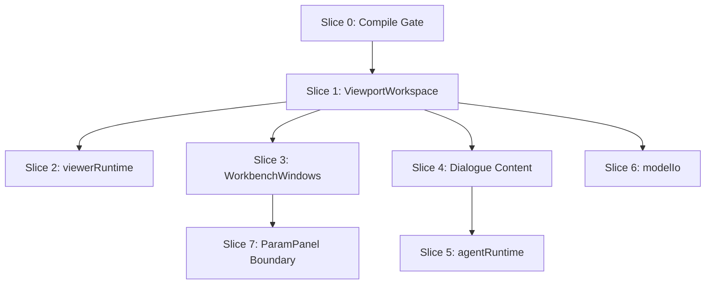

# App.svelte Decomposition Plan

Status: Planned
Owner: frontend
Rule: BDD outer loop first. No large rewrite. Extract one working seam at a time.

## Problem

`src/App.svelte` is the current workbench orchestrator and is too large for reliable changes.

Current pressure points:

- viewport render/cache behavior lives beside project switching, params, dialogue, agent state, export, import, sketch preview, and window layout
- params window latency is hard to isolate
- viewer selection/orbit behavior regressed because event wiring and semantic state are tangled
- project preview and visible viewport cache keys are not isolated enough
- App owns too many cross-domain handlers, so small fixes carry large blast radius

Current rough sizes:

| File | Lines | Role |
| --- | ---: | --- |
| `src/App.svelte` | 4112 | workbench god component |
| `src/lib/ParamPanel.svelte` | 3767 | params, semantic controls, viewer toggles |
| `src/lib/Viewer.svelte` | 2567 | Three.js viewport |
| `src/lib/ProjectSwitcher.svelte` | 1299 | project/thread browser |

## Target Shape

`App.svelte` should become a thin root shell:

- boot/session wiring
- top-level stores
- high-level route/view switch
- composition of workbench components
- no direct viewer cache logic
- no direct hidden viewer capture logic
- no direct agent terminal protocol logic
- no import/export branch tree

Target modules:

| Module | Type | Owns |
| --- | --- | --- |
| `src/lib/workbench/ViewportWorkspace.svelte` | Svelte component | visible viewer, hidden viewer, sketch preview status, viewport action strip |
| `src/lib/workbench/WorkbenchWindows.svelte` | Svelte component | dock buttons, window shells, lazy mounting |
| `src/lib/dialogue/DialogueWindowContent.svelte` | Svelte component | dialogue toolbar, PromptPanel, agent footer |
| `src/lib/composables/viewerRuntime.ts` | TS composable | viewer load waiters, recovery, preview persistence, screenshot capture |
| `src/lib/composables/agentRuntime.ts` | TS composable | agent polling, wake/stop/restart, terminal send/resize |
| `src/lib/composables/modelIo.ts` | TS composable | import/export handlers, save dialog branching |

## Slice Order

### Slice 0: Compile Gate

Goal: restore clean baseline before frontend cuts.

Work:

- fix current Rust compile issue in `src-tauri/src/mcp/handlers.rs`
- run `cd src-tauri && cargo check`
- run narrow frontend unit tests only if touched files require it

Acceptance:

- `cargo check` passes
- no frontend extraction starts from broken baseline

Parallelism:

- none; this gates all other slices

### Slice 1: Viewport Workspace Component

Goal: isolate viewport UI without moving viewer state yet.

Extract from `App.svelte`:

- visible `Viewer`
- hidden `Viewer`
- sketch preview status block
- viewport bottom actions: code, fork, export
- busy mask props
- viewer mode/topology/outline props
- model loaded/error event pass-through

New file:

- `src/lib/workbench/ViewportWorkspace.svelte`

Keep in `App.svelte`:

- source of state
- handlers
- derived values

Acceptance:

- e2e: Given open project, When model loads, Then viewport shows current model
- e2e: Given params window toggled, When opened/closed, Then viewer model does not reload
- e2e: Given sketch preview, When active, Then diagnostic status still shows

Parallelism:

- one frontend agent only; conflicts with any viewport work

### Slice 2: Viewer Runtime Composable

Goal: isolate cache/reload/recovery behavior after component shell exists.

Extract from `App.svelte`:

- `ViewerLoadWaiter`
- visible/hidden waiter arrays
- `waitForViewerLoad`
- `handleVisibleViewerLoaded`
- `handleHiddenViewerLoaded`
- `handleVisibleViewerLoadError`
- `handleHiddenViewerLoadError`
- `recoverVisibleViewerRuntime`
- `persistVisibleVersionPreview`
- live/hidden screenshot capture helpers

New file:

- `src/lib/composables/viewerRuntime.ts`

Acceptance:

- unit: model key changes across project switch
- unit: same artifact keeps viewer model key stable only when expected
- unit: missing viewer artifact recovery forces reload once
- e2e: Given project A loaded, When project B selected, Then viewport changes without manual rerender
- e2e: Given hidden capture runs, Then visible viewer camera/model stay unchanged

Parallelism:

- conflicts with Slice 1
- can run in parallel with Slice 3 after Slice 1 lands

### Slice 3: Workbench Windows Component

Goal: remove dock/window markup and lazy mount policy from root.

Extract from `App.svelte`:

- top dock buttons
- Projects/Params/Dialogue/Settings window shells
- `mountedWindows`
- params/dialogue lazy mount effect
- sketch window mount shell if it stays in workbench layout

New file:

- `src/lib/workbench/WorkbenchWindows.svelte`

Acceptance:

- e2e: Params opens from dock
- e2e: Projects opens from dock
- e2e: window close persists hidden state
- e2e: Params open latency does not wait for model selection work

Parallelism:

- can run in parallel with Slice 2 after Slice 1 lands
- avoid touching `ParamPanel.svelte` internals in this slice

### Slice 4: Dialogue Window Content

Goal: isolate dialogue UI and prompt wiring.

Extract from `App.svelte`:

- dialogue toolbar
- remember capture checkbox
- `PromptPanel` block
- message pagination props
- agent session footer

New file:

- `src/lib/dialogue/DialogueWindowContent.svelte`

Acceptance:

- e2e: user prompt submits
- e2e: pending state visible
- e2e: queued/live MCP prompt state visible
- unit: dialogue state props render expected branch

Parallelism:

- can run in parallel with Slice 2 and Slice 3
- low conflict if no shared store signatures change

### Slice 5: Agent Runtime Composable

Goal: remove agent transport and terminal protocol from root.

Extract from `App.svelte`:

- `refreshThreadAgentState`
- agent polling interval
- wake/stop/restart primary agent
- terminal input submit/raw send/resize
- optimistic queued message helpers
- queued batch auto-drain

New file:

- `src/lib/composables/agentRuntime.ts`

Acceptance:

- unit: polling disabled without active thread
- unit: terminal submit routes to active session
- unit: queued prompt drains newest prompt per thread
- e2e/manual: wake agent button still changes visible state

Parallelism:

- can run in parallel with Slice 3
- conflicts with Slice 4 if both edit dialogue props; sequence prop contract first

### Slice 6: Model IO Composable

Goal: remove export/import branch tree from root.

Extract from `App.svelte`:

- `handleExport`
- FCStd import
- FreeCAD library import
- export chooser action wiring

New file:

- `src/lib/composables/modelIo.ts`

Acceptance:

- unit: export options route to correct Tauri call
- e2e: export chooser opens
- e2e: import path creates thread and shows imported model

Parallelism:

- can run in parallel with Slice 4 and Slice 5
- avoid touching `ProjectSwitcher.svelte` in same PR/slice

### Slice 7: ParamPanel Boundary Cleanup

Goal: reduce callback threading between params, semantic controls, viewer toggles.

Work:

- keep existing `ParamPanel` subcomponents
- move viewer display mode contract into typed event/value object
- keep `camelCase` frontend props
- do not move semantic control internals unless tests require it

Acceptance:

- unit: orbit/select/measure changes emit one typed mode change
- unit: topology/outline changes do not mutate params
- e2e: select mode does not make params window sluggish

Parallelism:

- do after Slice 3
- conflicts with viewport interaction fixes

## Parallel Work Plan

Use branches or stacked patches by slice. Do not let agents edit same files unless one branch is read-only.

| Lane | Agent | Slices | Main files | Can run with |
| --- | --- | --- | --- | --- |
| A | Helmholtz | Slice 0, Slice 1, Slice 2 | `App.svelte`, `ViewportWorkspace.svelte`, `viewerRuntime.ts` | none for Slice 0/1; B/C after Slice 1 |
| B | Sagan | Slice 3 | `App.svelte`, `WorkbenchWindows.svelte`, window store tests | C, D after Slice 1 |
| C | Pasteur | Slice 4, Slice 5 | dialogue component, `agentRuntime.ts`, agent tests | B, D with prop freeze |
| D | Erdos | Slice 6 | `modelIo.ts`, export/import tests | B, C |
| E | Kant | review lane | contracts, BDD coverage, no direct DB writes | all, read-only until review |
| F | Harvey | performance lane | params open latency, select-mode responsiveness | after Slice 3 |

Dependency graph:

## Conflict Rules

- Only one lane edits `src/App.svelte` at a time unless edits are pre-agreed line ranges.
- Slice owner must first add failing BDD or unit test.
- Component extraction must preserve visible markup and CSS first; behavior moves later.
- No store rename during extraction.
- No Tauri contract shape change without Rust `#[serde(rename_all = "camelCase")]` check.
- No direct DB writes from frontend tooling or scripts.
- No staging or commits unless requested.

## BDD Checklist Per Slice

Each slice must record:

- Given/When/Then test name
- initial failing output
- changed files
- passing proof
- known residual risk

Minimum proof before handoff:

- UI slice: Playwright real route/app proof for happy path
- UI slice: one failure/pending state
- Rust touched: `cd src-tauri && cargo check`
- TS logic touched: focused `npm run test:unit -- <test>` if available, otherwise `npm run test:unit`

## Done Definition

App decomposition is done when:

- `App.svelte` under 1800 lines
- viewport cache/reload behavior has unit tests outside Svelte component
- params dock open does not traverse project list/render cache code
- dialogue/agent terminal protocol is not in `App.svelte`
- import/export branch logic is not in `App.svelte`
- project switch cannot show stale model without failing test
- select mode cannot trigger semantic params recompute while orbiting
