# Ecky IR Field Guide

Parenthesized `.ecky` forms compile to a fixed operation set; default rendering is exact B-rep.

## First Solid: Corner Bracket

A renderable file needs a `model` root, a named `part`, and geometry. The first
useful part is a **corner bracket**: one horizontal foot and one vertical flange
that cross at a corner and fuse into a single printable L-shape. Starting with
two primitives keeps each transform and boolean obvious.

Begin with one solid so the root, the part id, and the primitive are clear.

```scheme
(model
  (part bracket
    (box 40 40 6)))
```

`model` is the root. `part` gives the geometry a stable id (`bracket`). `box`
produces one solid centered at the origin. Nothing is joined yet.

Make the bracket from two solids that share the corner. A long thin foot and a
long thin flange, each crossing the origin, overlap in a small square region.
`union` fuses that overlap into one connected part.

```scheme
(model
  (part bracket
    (union
      (box 40 8 6)
      (box 8 40 6))))
```

The foot is `40 x 8 x 6`; the flange is `8 x 40 x 6`. Both start at the origin,
so they overlap in an `8 x 8 x 6` corner. That deliberate overlap is what makes
the union produce one connected L-bracket instead of two loose pieces. `union`
merges overlapping solids; it does not glue solids that merely touch at a face.

When the foot and flange must sit at different heights, move one with
`translate` so the overlap is preserved, not destroyed.

```scheme
(model
  (part bracket
    (union
      (box 40 8 6)
      (translate 0 0 3
        (box 8 40 6)))))
```

`translate 0 0 3` lifts the flange so it still crosses the foot by half its
thickness. The overlap region shrinks but never disappears, so the union stays
one body. Move geometry to control placement; keep enough overlap so the
boolean has connected material to merge.

Use this pattern for the first real part: name the part, place primitives so
they overlap, then join them with one boolean.

> **Watch for:** primitives start at the origin. Two solids that do not overlap
> produce a union of two disconnected bodies, not one part. If a union has the
> right members but reads as two pieces, inspect placement and overlap before
> changing the boolean.

## Sketch to Solid: Plate from a Profile

Many parts begin as a closed 2D region. `extrude` turns that region into a solid with a specified height.

```scheme
(model
  (part plate
    (extrude
      (rounded-rect 70 42 5)
      4)))
```

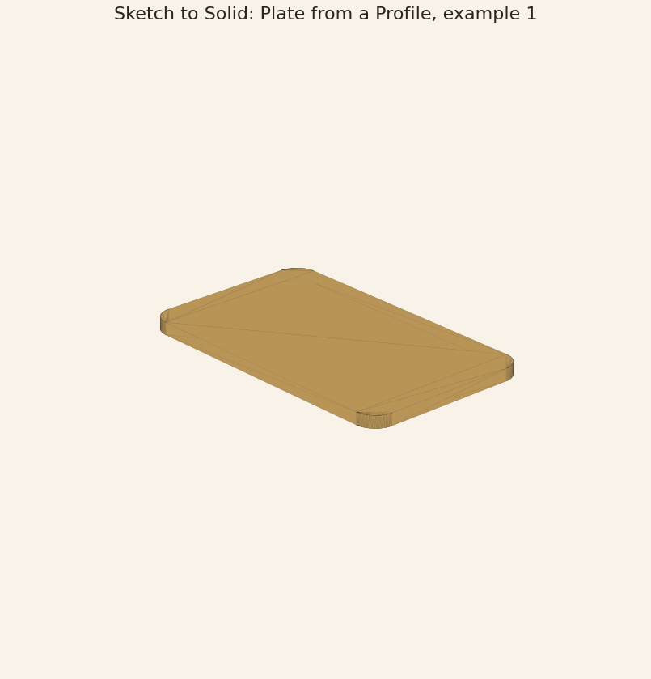

`rounded-rect` is the closed 2D profile. `extrude` gives it thickness.

Use `profile` when the shape has holes.

```scheme
(model
  (part washer_plate
    (extrude
      (profile
        :outer (rounded-rect 70 42 5)
        :holes (circle 9 64))
      4)))
```

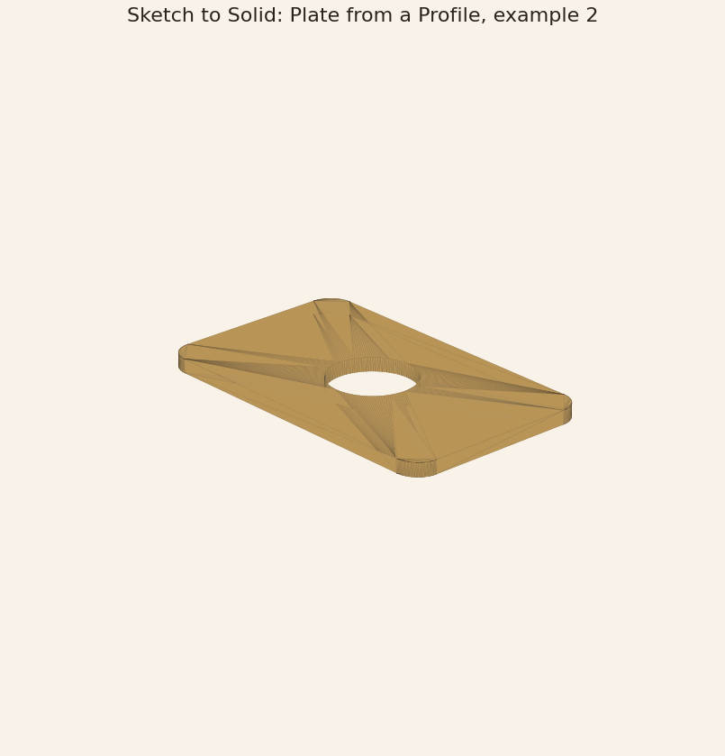

The outer profile defines material. The hole profile removes material during the extrusion.

The modeling sequence stays explicit: define a region, then choose how it becomes three-dimensional.

Use `offset` to grow or shrink a 2D outline by a fixed distance before extruding. A positive distance pushes the outline outward.

```scheme
(model
  (part gasket
    (extrude
      (profile
        :outer (offset 3 (rounded-rect 30 18 4))
        :holes (rounded-rect 30 18 4))
      4)))
```

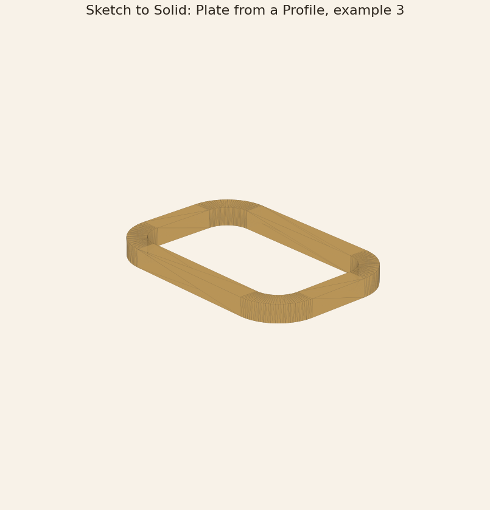

`offset 3` creates the outer boundary; the original outline becomes the hole. The resulting gasket has a uniform 3 mm wall.

`scale` stretches a profile by separate x, y, z factors. Scale a circle in one axis and it becomes an ellipse, so you reach for `scale` instead of a separate ellipse primitive.

```scheme
(model
  (part oval_plate
    (extrude (scale 1.6 1 1 (circle 10 48)) 5)))
```

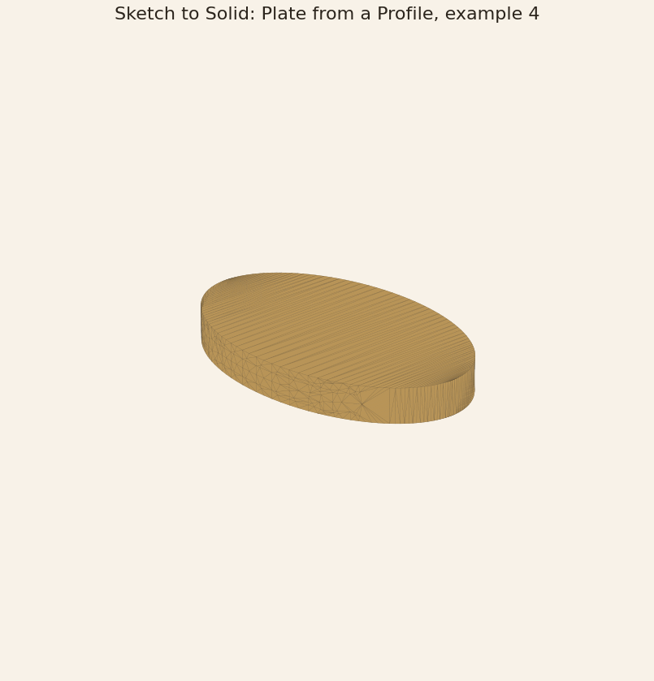

> **Watch for:** `extrude` only works on a _closed_ region. An open polyline or a profile whose `:holes` poke through the `:outer` edge has no well-defined inside, and the extrude fails or produces junk. Keep holes strictly inside the outer boundary, and reach for `profile` (not a raw shape) the moment material needs to be removed — the `:outer`/`:holes` split is what tells Ecky which side is solid.

## Convenience Shapes: Stop Hand-Building Common Outlines

Use named convenience shapes when they express the design directly. They avoid repeated outline math and preserve analytic geometry where the backend supports it.

A **torus** is a ring: major radius to the tube centre, minor radius of the tube.

```scheme
(model
  (part ring
    (torus 20 5)))
```

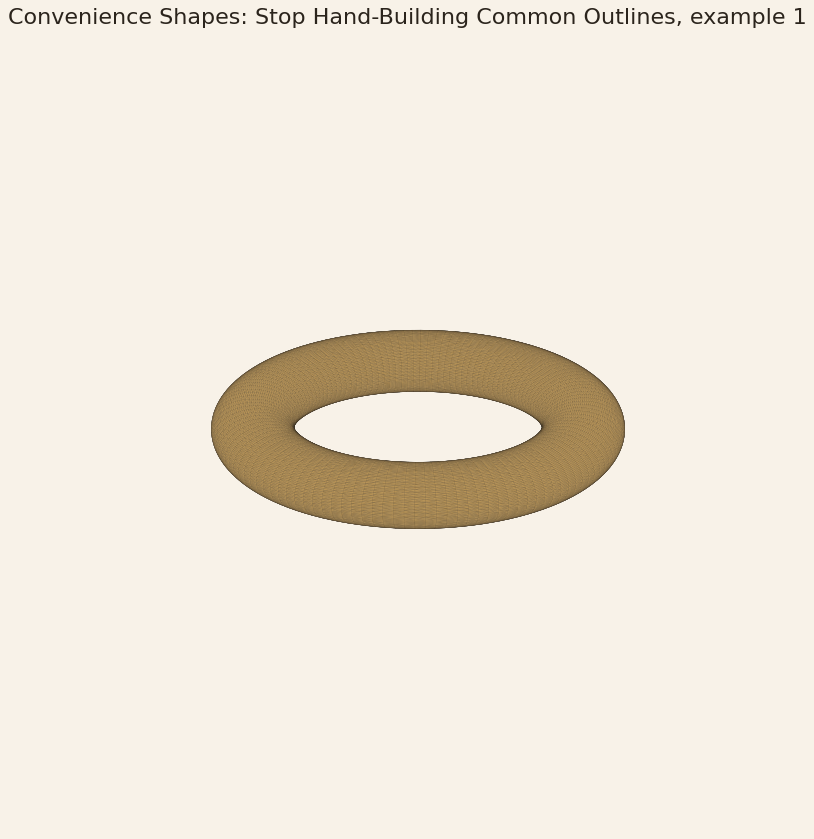

An **ellipse** is a 2D profile — give it the x and y radii, then `extrude` it like any sketch. When the y radius is larger, the long axis simply swings to y; you do not rotate anything yourself.

```scheme
(model
  (part oval
    (extrude (ellipse 18 10) 4)))
```

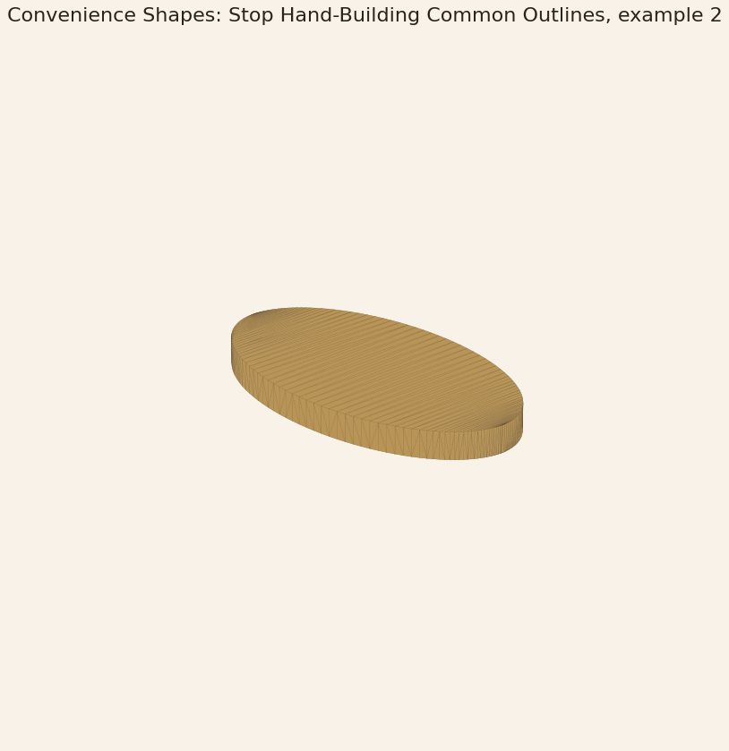

A **regular-polygon** takes a side count and a circumradius (optionally `:rotation`).

```scheme
(model
  (part hex
    (extrude (regular-polygon 6 12) 5)))
```

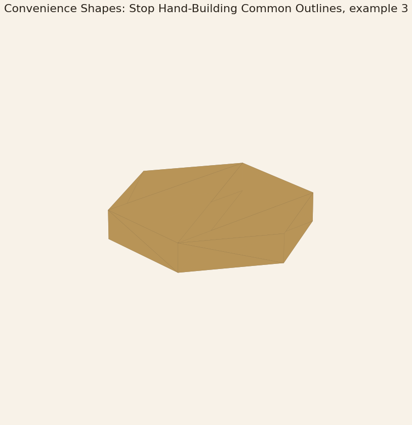

A **trapezoid** takes the bottom width, top width, and height; add `:skew` to slide the top sideways.

```scheme
(model
  (part wedge_plate
    (extrude (trapezoid 40 24 18 :skew 4) 5)))
```

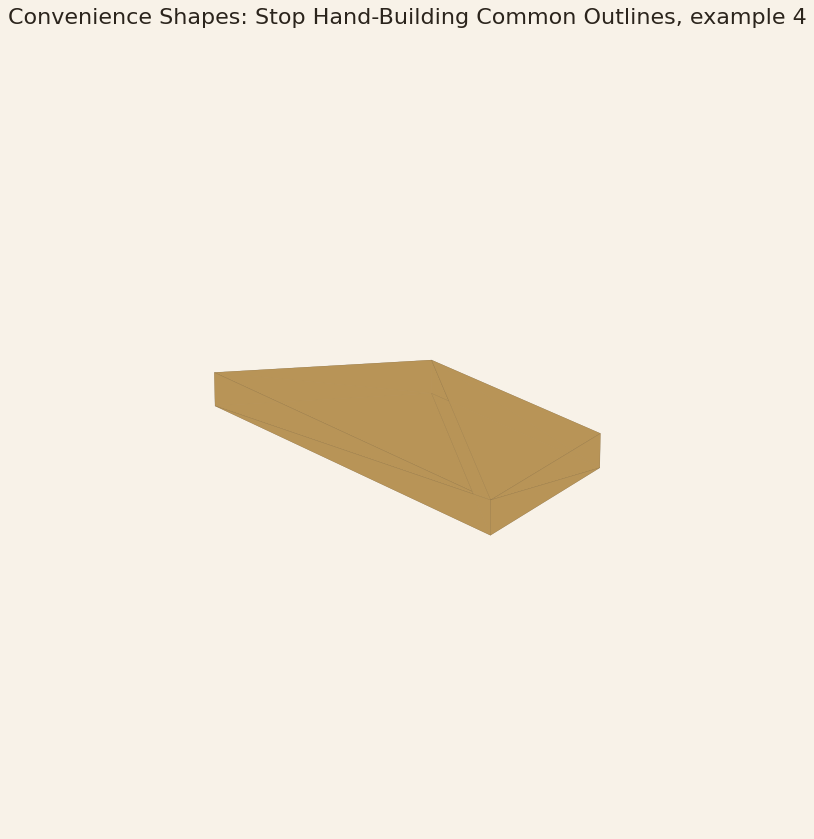

A **wedge** is the 3D ramp: a `dx × dy × dz` box whose top face shrinks to the rectangle `xmin..xmax` by `zmin..zmax`.

```scheme
(model
  (part ramp
    (wedge 40 20 30 10 5 30 25)))
```

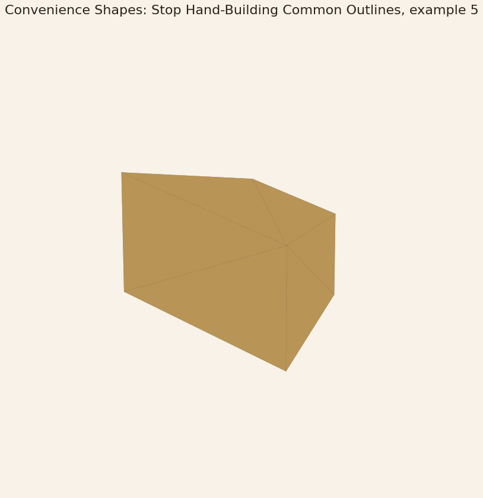

### Slots

A slot is an obround — a rectangle capped by two semicircles. Four front-ends describe the same shape from whatever you happen to know.

`slot-overall` takes the tip-to-tip length and the width.

```scheme
(model
  (part track
    (extrude (slot-overall 50 12) 4)))
```

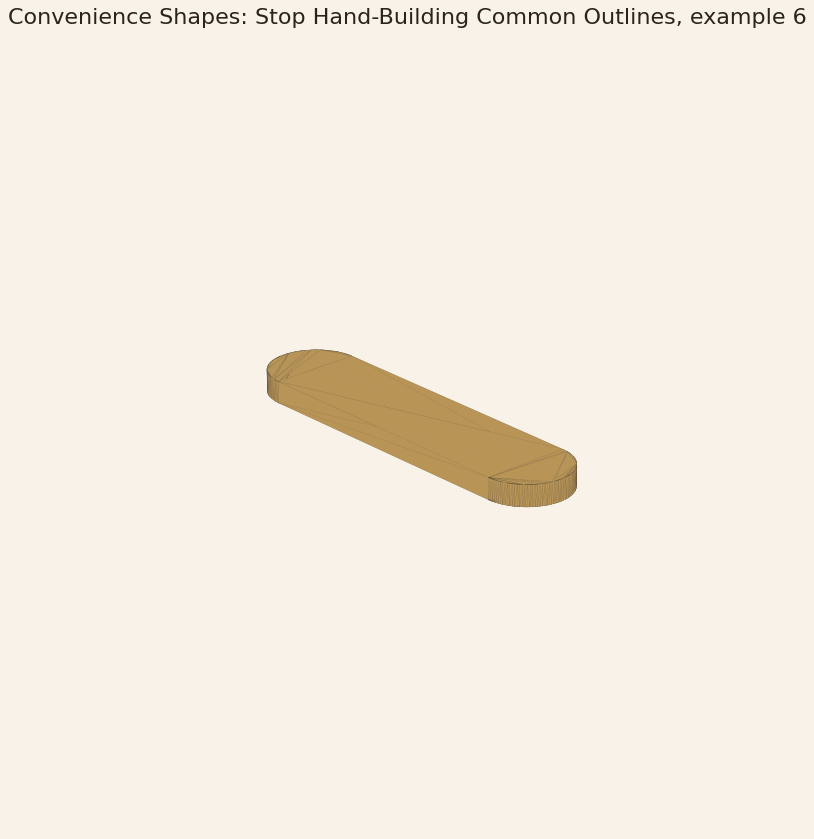

`slot-center-to-center` takes the distance between the two end-arc centres and the width.

```scheme
(model
  (part track_c2c
    (extrude (slot-center-to-center 38 12) 4)))
```


`slot-center-point` takes the slot centre `(cx cy)`, the centre of one end arc `(px py)`, and the width — handy when you already know where the holes go. It orients itself along the line between the two points.

```scheme
(model
  (part track_cp
    (extrude (slot-center-point 0 0 30 0 12) 4)))
```


`slot-arc` curves the slot along a circular arc: centreline radius, start and end angle (degrees), and width.

```scheme
(model
  (part curved_track
    (extrude (slot-arc 30 0 120 10) 4)))
```

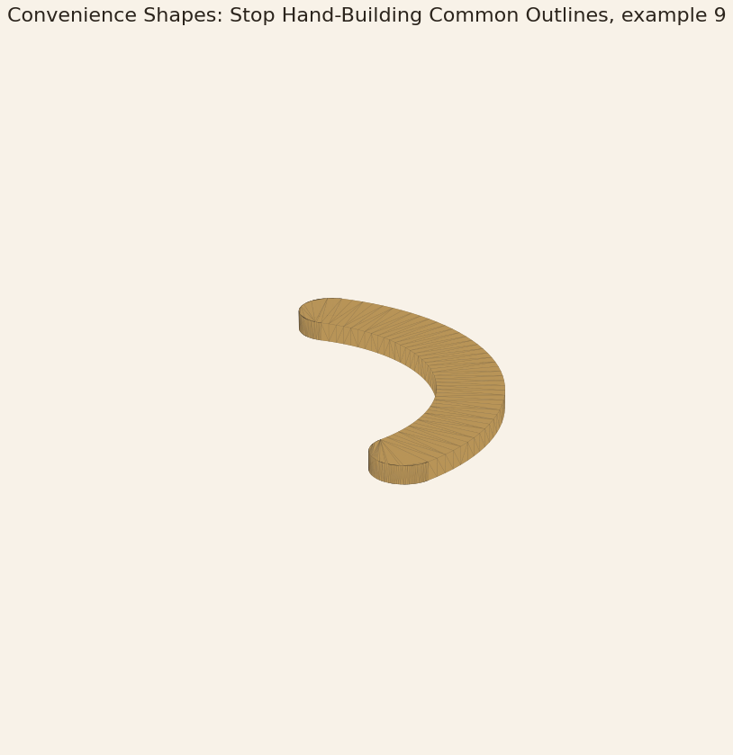

> **Watch for:** the slot, ellipse, regular-polygon, and trapezoid examples here are 2D profiles — they need an `extrude` (or `revolve`) to become a solid. `torus` and `wedge` are already solids, so they stand alone.

### Threads

`thread` builds a screw thread by sweeping a ridge along a helix around a core cylinder — you do not hand-build the helix. Give it a radius, pitch, length, and depth.

```scheme
(model
  (part screw
    (thread :radius 6 :pitch 1.5 :length 18 :depth 0.9)))
```

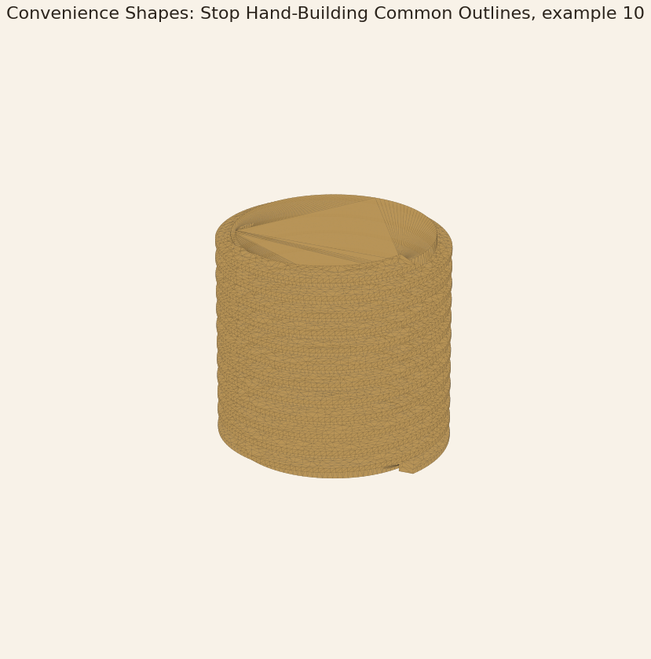

For standard hardware, `:iso "M…"` decodes an ISO metric coarse-pitch designation into the radius, pitch, and depth for you — pass only the length.

```scheme
(model
  (part bolt
    (thread :iso "M8" :length 20)))
```

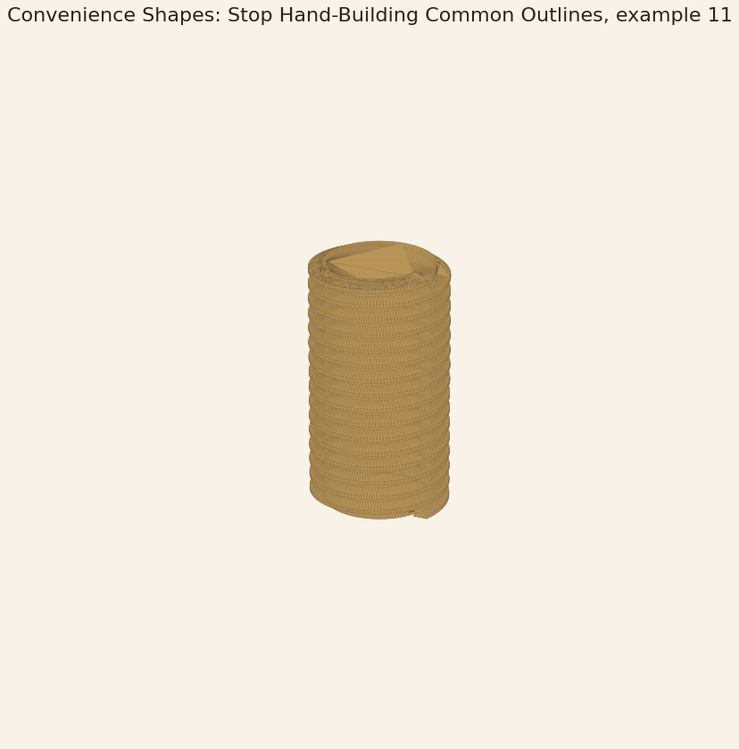

`:female #t` makes the matching cutter instead of a solid screw. Subtract it from a bore to tap a hole; `:clearance` widens the envelope so the parts actually mate.

```scheme
(model
  (part nut
    (difference
      (cylinder 10 8)
      (thread :iso "M8" :length 8 :female #t :clearance 0.2))))
```

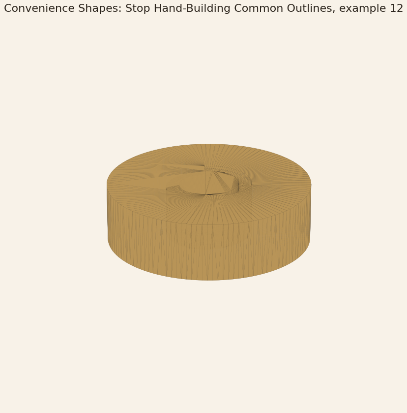

`:lefthand #t` reverses the helix. Unknown ISO designations (e.g. `"M7"`) fail with a clear error rather than guessing.

## Parameters: Make the Plate Editable

Parameters separate design inputs from derived geometry. Declare editable dimensions once under `params`; the UI reads their metadata and the model reads their keys.

```scheme
(model
  (params
    (number plate_w 70 :label "Plate width" :min 40 :max 120 :step 1)
    (number plate_h 42 :label "Plate height" :min 20 :max 80 :step 1)
    (number corner_r 5 :label "Corner radius" :min 0 :max 12 :step 0.5)
    (number thickness 4 :label "Thickness" :min 1 :max 12 :step 0.5))
  (part plate
    (extrude
      (rounded-rect plate_w plate_h corner_r)
      thickness)))
```


The geometry reads the parameter names directly. The UI reads labels, min/max, and step from the declarations.

Keep parameters physical: widths, heights, clearances, radii. Put derived math near the geometry.

```scheme
(shape hole_r (/ bore_d 2))
```

That line is better than repeating `(/ bore_d 2)` through cuts and selectors.

### Units: bare numbers already have one

Ecky uses **millimeters for length** and **degrees for angles**. Bare numbers already use those base units: `(box 70 42 4)` is 70 × 42 × 4 mm, while `(rotate 90 0 0 ...)` rotates 90 degrees.

When you do write one, the suffix is a **conversion into that base unit** — nothing more:

| Suffix | Family | Becomes |
| --- | --- | --- |
| `mm` | length | itself (`12mm` → `12`) |
| `cm` | length | ×10 (`1cm` → `10`) |
| `in` | length | ×25.4 (`1in` → `25.4`) |
| `deg` | angle | itself (`90deg` → `90`) |
| `rad` | angle | ×(180/π) (`1.5708rad` → `90`) |

So `(box 12mm 1cm 1in)` is exactly `(box 12 10 25.4)`, and `(rotate 1.5708rad 0 0 ...)` is the same 90-degree turn as `(rotate 90 0 0 ...)`. Suffixes exist so you can author in the unit a spec is written in and let Ecky normalize.

**Some numbers stay unitless on purpose.** Counts (`(repeat 5 ...)`), ratios, segment counts on a cylinder (`(cylinder 6 12 96)` — that `96` is facets, not millimeters), and indices are pure numbers. A suffix on them is meaningless; leave them bare.

**Unit suffixes convert values; they do not type-check dimensions.** `45deg` in a width slot becomes the number `45`, then the box reads it as 45 mm. Use length suffixes for lengths, angle suffixes for angles, and bare values for counts and ratios.

## Cut and Join: Mounting Plate

Use `build` when a part needs several boolean stages. Each `shape` names an intermediate result; `result` identifies the final geometry. Names keep cutters and later selectors readable.

```scheme
(model
  (params
    (number plate_w 80)
    (number plate_h 48)
    (number thickness 5)
    (number hole_r 4))
  (part mount
    (build
      (shape blank
        (extrude (rounded-rect plate_w plate_h 4) thickness))
      (shape hole_left
        (translate -24 0 -0.5
          (cylinder hole_r (+ thickness 1))))
      (shape hole_right
        (translate 24 0 -0.5
          (cylinder hole_r (+ thickness 1))))
      (result
        (difference blank hole_left hole_right)))))
```


`build` names each step. `difference` subtracts cutters from the blank. The cutters are slightly taller than the plate so the cut passes fully through.

Add material with `union` or `fuse`.

```scheme
(result
  (union
    (difference blank hole_left hole_right)
    (translate 0 0 thickness
      (cylinder 12 8))))
```

The result is still one part, but the intent stays readable.

> **Watch for:** make cutters cross the stock completely; coincident cutter and stock faces can leave unstable slivers. Booleans also rebuild topology, so raw face and edge indices are not durable selectors. Use geometric selectors or tags after the boolean.

## Round, Chamfer, Shell: Select Edges and Faces

Finishing operations need two things: a radius or thickness, and a stable way to identify target topology. This chapter pairs `fillet`, `chamfer`, and `shell` with geometric selectors, tags, and native provenance selectors.

Edge operations happen after the main solid exists.

```scheme
(model
  (part soft_block
    (fillet 2
      :edges "top"
      (box 60 36 16))))
```

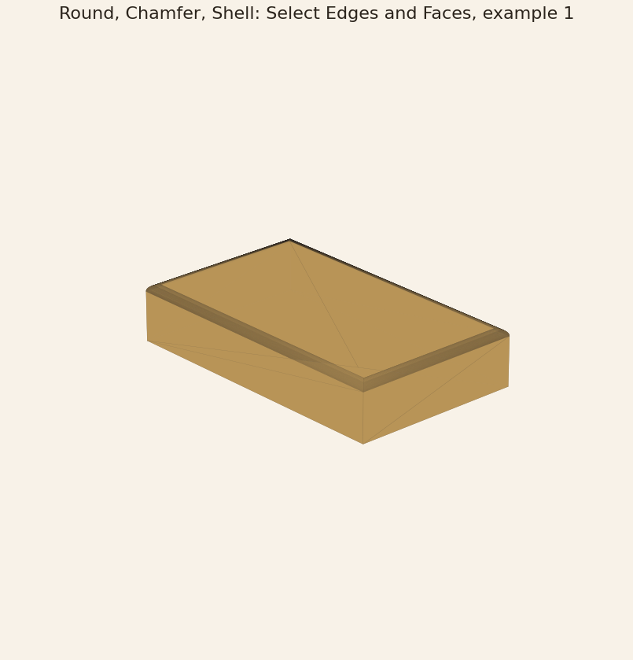

`:edges "top"` selects top boundary edges. Use `chamfer` when the edge should become flat instead of rounded.

```scheme
(model
  (part beveled_block
    (chamfer 1.5
      :edges "bottom"
      (box 60 36 16))))
```

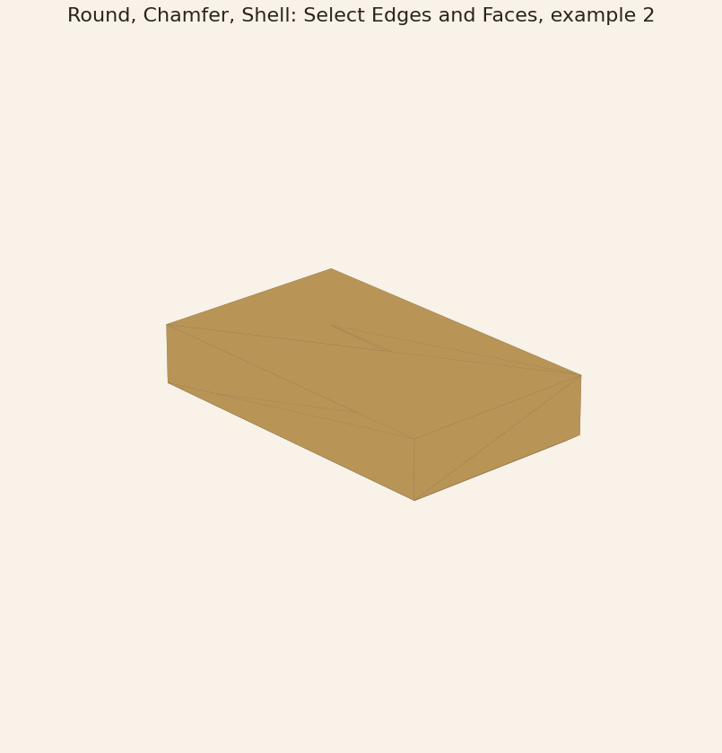

Use `shell` to hollow a solid by removing selected faces.

```scheme
(model
  (part open_tray
    (shell 2
      :faces "top"
      (box 70 44 22))))
```

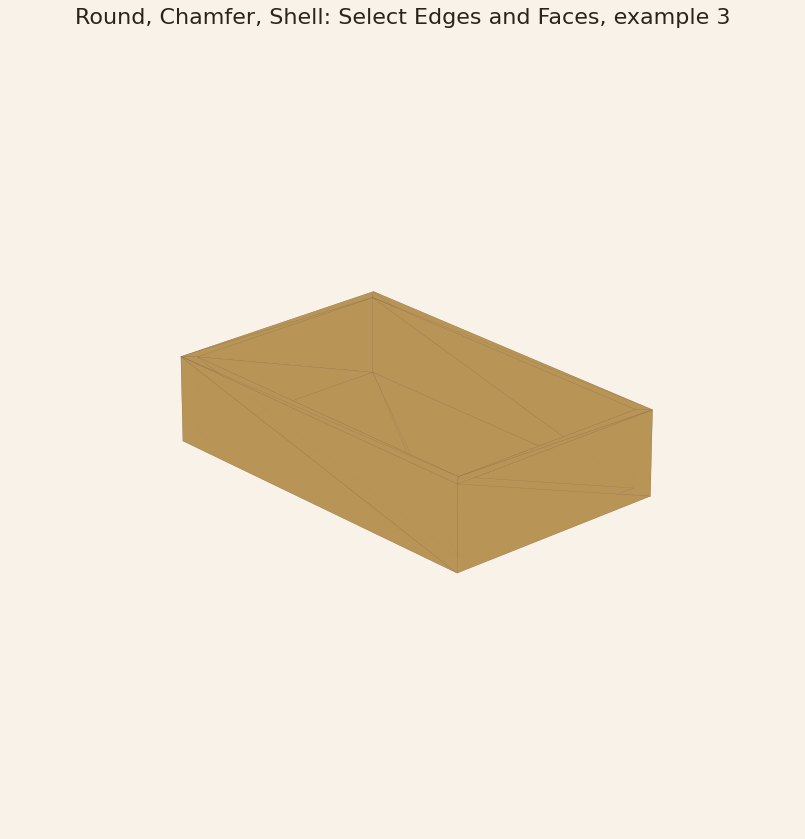

Selectors should describe a physical feature: top, bottom, planar normal, or a stable target id. Avoid anonymous offsets for fit-critical faces.

Tag any fit-critical selector. The tag records intended topology in the manifest, so param changes can rebind the same seat, lip, or opening instead of chasing backend face indexes.

```scheme
(model
  (tag-face tray_opening :faces "top" tray)
  (part tray
    (shell 2
      :faces (tag tray_opening)
      (box 70 44 22))))
```


When a `build` introduces helper solids, use `:created-by <shape>` to keep clause selectors scoped to topology from that intermediate shape only.

```scheme
(model
  (part body
    (build
      (shape blank (box 70 44 22))
      (shape pocket (translate 0 0 10 (box 30 18 12)))
      (shape tray (difference blank pocket))
      (result
        (shell 2
          :faces "planar+normal-z+area-max"
          :created-by pocket
          tray)))))
```

Here `:created-by pocket` limits face candidates to the cavity created from `pocket`, not every planar top-facing face on `tray`.

> **Native-only.** `:created-by` is a provenance selector: it relies on the
> originating-slot index that the native OCCT kernel tracks for every face and
> edge. It resolves only on the native backend (Ecky's default). FreeCAD
> interop has no slot-provenance index, so it rejects `:created-by` rather
> than guess. If you lower a model through FreeCAD interop, drop the
> `:created-by` clause and lean on the geometric predicates (`planar`,
> `normal-z`, `area-max`) or a `tag-face` instead.

### Tapered fillets

A normal `fillet` uses one radius. Add `:to-radius` and the radius varies along each selected edge — it starts at the base radius and eases to the second one. Handy for blends that need to grow or shrink along a run.

```scheme
(model
  (part p
    (fillet 4 :to-radius 1 :edges "top" (box 40 40 20))))
```

> **Backend note:** tapered fillets are an OCCT capability rendered by the native backend. FreeCAD interop may reject `:to-radius`; use native rendering for tapered fillets.

### Draft

`draft` tilts the side walls of a solid by an angle so a molded part can release from its tool. It tapers every vertical face about a neutral plane (the level that stays the original size); pass `:neutral-z` to move that plane, otherwise it sits at `z = 0`.

```scheme
(model
  (part p
    (draft 8 (box 30 30 20))))
```

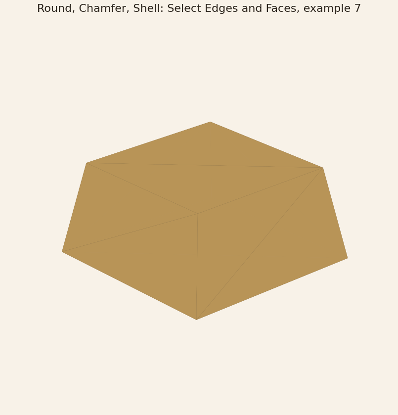

> **Backend note:** draft is rendered by the native OCCT path. The FreeCAD backend has no Part draft API, so it rejects `draft` with a clear error. This first cut drafts *all* vertical faces; targeting specific faces with a `:faces` selector is a planned extension.

## Paths and Surfaces: Revolve and Sweep

Choose a surface operation from the motion of a profile: rotate it around an axis, carry it along a path, or interpolate between several sections.

Use `revolve` when a 2D profile turns around an axis.

```scheme
(model
  (part knob
    (revolve
      (make-face
        (path
          (12 0 0)
          (18 0 0)
          (18 18 0)
          (10 24 0)
          (12 0 0)))
      360)))
```

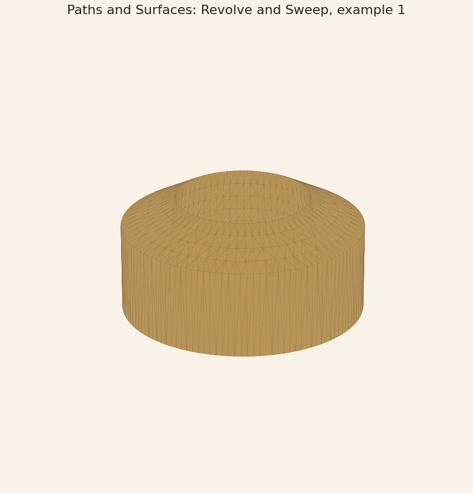

`path` creates the outline. `make-face` turns the closed outline into a face. `revolve` spins it into a solid.

Use `sweep` when a profile follows a path.

```scheme
(model
  (part handle
    (sweep
      (circle 2.2 32)
      (bezier-path
        ((-24 0 0) (-10 18 6) (10 18 6) (24 0 0))))))
```

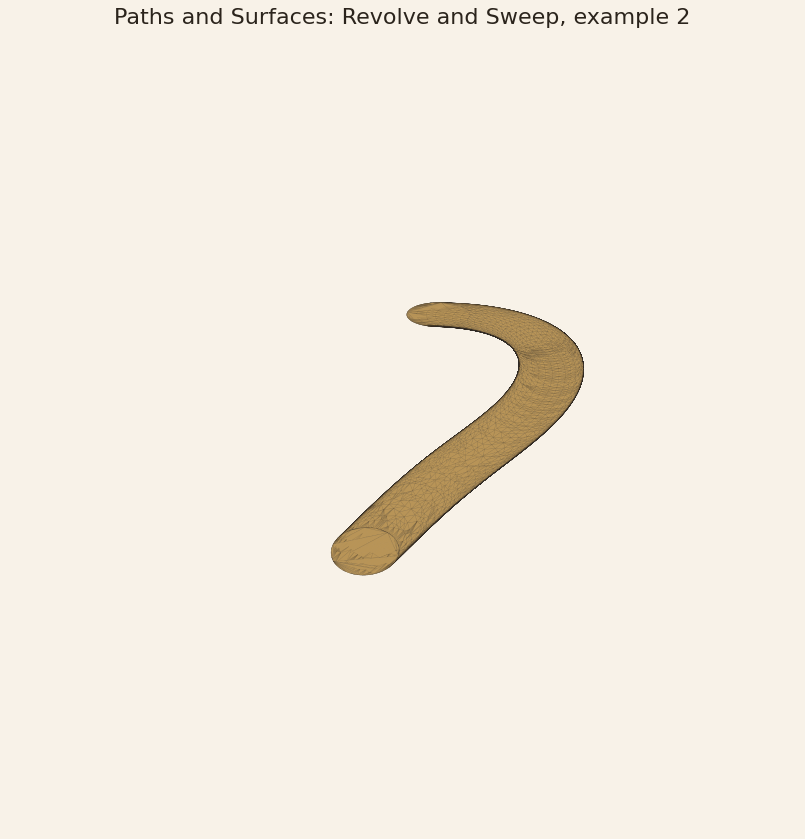

The circle is the cross-section. The bezier path is the centerline. Sweep keeps those responsibilities separate.

Use `loft` when one profile needs to become another profile across height or distance.

```scheme
(model
  (part nozzle
    (loft 24
      (circle 14 32)
      (circle 5 32))))
```

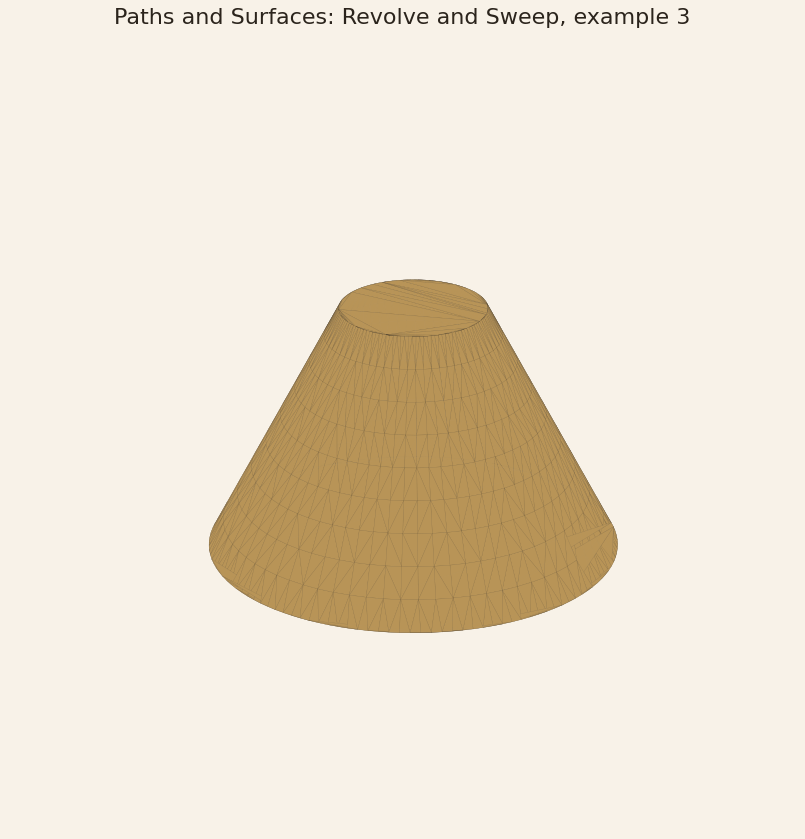

The first profile is the base, the last is the cap, and `loft` skins a smooth wall between them. The leading number is the total height; profiles stack evenly along it, so the wide circle sits at the bottom and the narrow one at the top.

### Ribs and grooves

`rib` and `groove` are the two-step "sweep a profile, then combine" move rolled into one op. Both take a solid, a profile, and a path: `rib` sweeps the profile along the path and fuses the result onto the solid (a reinforcing rib); `groove` sweeps it and cuts it away (a channel).

```scheme
(model
  (part p
    (rib
      (box 20 20 20)
      (circle 3)
      (path (0 0 0) (0 0 30)))))
```

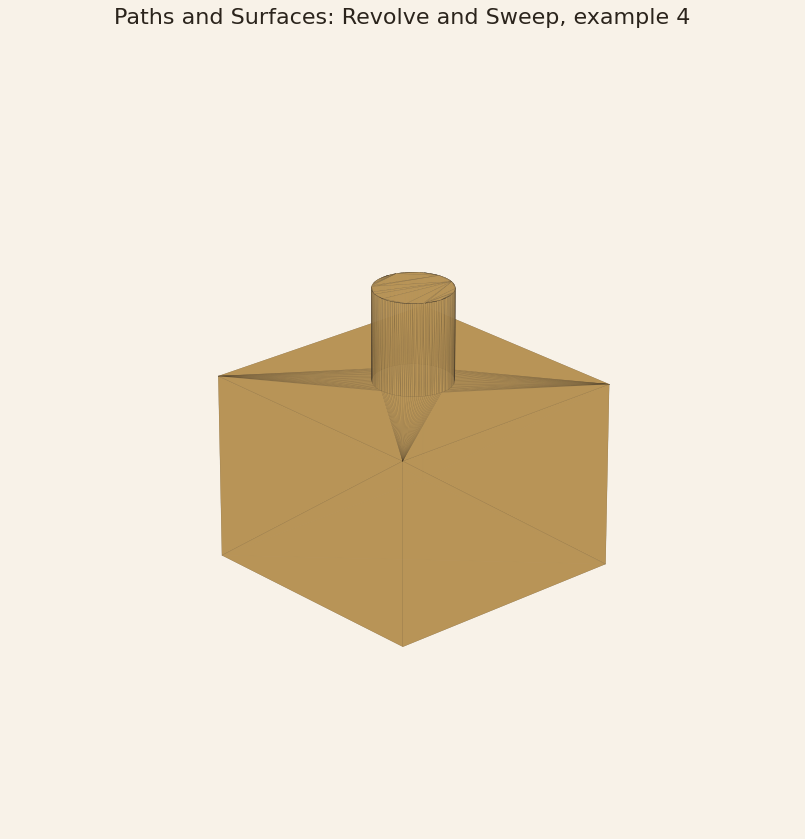

Swap `rib` for `groove` to subtract the same swept run instead of adding it. They lower to `sweep` + `union`/`difference`, so they render on every backend.

## Repetition: Ribs, Slots, and Patterns

Represent repeated geometry with one body and an index. This keeps count, spacing, and fit math editable in one place.

```scheme
(model
  (part ribbed_plate
    (build
      (shape base
        (box 90 40 4))
      (shape ribs
        (repeat-union i 5
          (translate (- (* i 18) 36) 0 5
            (box 4 34 6))))
      (result
        (union base ribs)))))
```

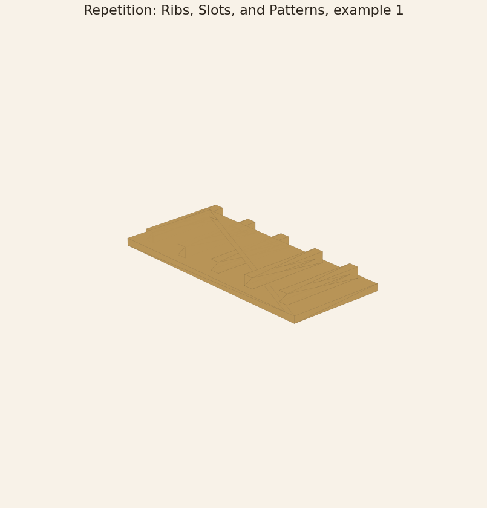

`repeat-union` makes one merged body from repeated solids. The index `i` is local to the repeat body.

When repeated features share the same fit math, hoist derived values once instead of repeating arithmetic at every call site. Use model-level `let*` for dependent dimensions, a helper `define` for placement math, and `define-component` when one repeated body needs the same closed geometry everywhere.

```scheme
(define (divider-depth tray_d wall)
  (- tray_d (* 2 wall)))

(define-component divider
  ((number height 12) (number depth 34))
  (box 4 depth height))

(model
  (let* ((tray_d 40)
         (wall 3)
         (pitch 18)
         (slot_w 6)
         (rib_h 12)
         (divider_d (divider-depth tray_d wall)))
    (part tray
      (difference
        (union
          (box 80 tray_d 18)
          (repeat-union i 4
            (translate (- (* i pitch) 27) 0 9
              (divider :height rib_h :depth divider_d))))
        (repeat-union i 4
          (translate (- (* i pitch) 27) 0 0
            (box slot_w 30 20)))))))
```

Here `pitch`, `slot_w`, and `wall` each have one definition. `divider-depth` owns the offset calculation, while `divider` owns the repeated body. Lift shared math or geometry as soon as a second call site appears.

Use `repeat-compound` when repeated items should stay grouped instead of merged.

```scheme
(shape rollers
  (repeat-compound i 4
    (translate (- (* i 16) 24) 0 8
      (cylinder 3 8))))
```

Use `repeat-pick` when only some indices should produce geometry.

```scheme
(shape end_stop
  (repeat-pick i 5 (= i 4)
    (translate 36 0 12
      (sphere 4))))
```

### Common mistake: `(define ...)` inside `(model ...)`

`(define ...)` is only valid at the **top level** (outside `(model ...)`), where it
defines reusable helper functions like `divider-depth` above. Inside `(model ...)`,
Steel evaluates `define` eagerly — before params have values — so any arithmetic
on a param produces a misleading `TypeMismatch` error instead of a clear message.

**Wrong** — define inside model:
```scheme
(model
  (params (number frame_length 160))
  (define half_len (/ frame_length 2))   ; ← TypeMismatch at runtime
  (part body (box half_len 10 10)))
```

**Right** — `let*` inside the part:
```scheme
(model
  (params (number frame_length 160))
  (part body
    (let* ((half_len (/ frame_length 2)))
      (box half_len 10 10))))
```

The rule is simple: **`define` for top-level helper functions, `let*` for computed
values inside parts.** If a derived value needs to reference a param, it belongs
in a `let*` binding scoped to the part (or a `let*` wrapping model clauses that
spans multiple parts).

## Physical Fit: Dovetail Rail and Channel

A dovetail is a sliding fit between a male rail and a female channel. The two
parts mate because the channel is slightly larger than the rail, and that
slight difference **is** the fit. Make the difference one named number and the
whole fit becomes editable from one place.

The trap is authoring each side with its own hard-coded offset: the rail at its
nominal size, the channel widened by a magic literal like `0.6`. That works
once, but the moment you want a looser or tighter fit you have to find and edit
two offsets that were never linked. Worse, the two numbers drift apart with
every edit until the parts no longer mate.

The fix is a single named clearance binding shared by both sides:

- the **male** side uses the nominal profile directly;
- the **female** side is the same profile enlarged by the clearance on every
  side (`nominal + 2 * clearance`).

Change the clearance once and only the channel moves — the rail stays nominal,
so the fit changes through one relation instead of two anonymous offsets.

Reuse a proven profile instead of redesigning it. The dovetail rail in the
film-adapter mechanism is already a tested triangular profile; extracting that
profile and its clearance relation into a smaller fixture preserves the fit
math without inventing a second dovetail. The surrounding mechanism (film path,
detents, helicoid) is complexity you can drop; the mating profile and the named
clearance are what you keep.

When the two mating parts are separate exportable solids, keep any
preview-only assembly placement (a rail hovered above a channel for display)
out of the exported geometry. Each part should export as the clean solid it
really is; the assembly view is a diagnostic, not a feature of either part.

## Components and Reuse: Lift a Proven Part

Use a component when geometry must be reused across parts or models. A component packages a closed parameter signature, its geometry, and verification clauses; each instance reuses that definition without copying source.

This component defines a bored mounting standoff and carries its minimum-wall check:

```scheme
(define-component standoff
  ((number height 12 :label "Standoff height" :min 6 :max 30)
   (number bore 3.2))
  (verify (tag bore_open) (metric min_wall_thickness "body") (expect (>= value 1.2)))
  (difference
    (cylinder 6 height 96)
    (cylinder bore (+ height 2) 96)))

(model
  (part front_left (standoff :height 16))
  (part rear_right (translate 40 0 0 (standoff))))
```

Three rules define component behavior.

**Reuse by reference, override by keyword.** `(standoff :height 16)` instantiates the component and overrides one signature key; `(standoff)` takes every default. Omitted keys fall back to the signature, and a missing _required_ key (one with no default) is a compile error that names the component and lists its signature. There is no copy-paste, so there is no drift: change the body once and both parts move together.

**Closedness makes reuse reliable.** A component body sees signature keys, local bindings (`let`, `let*`, repeat indices, and build shapes), other declared components, and immutable top-level `define` helpers from the same source. Referencing a model parameter without passing it through the signature, or referencing an undeclared global, is a compile error. Component packages must carry captured helper definitions with the component source.

**Verification expands per instance.** The component's `verify` clause is namespaced by part key, producing tags such as `front_left/bore_open` and `rear_right/bore_open`. Every instance runs the same wall-thickness requirement.

For the exact signature grammar, nesting limits, and verify-travel rules, see **`define-component`** in the language reference appendix.

### The library loop (MCP)

Components do not have to live in one file. Agents lift proven parts into a shared library and pull them back by source:

1. `component_extract` — hand it a model and a `partKey`. Referenced model params become the signature (metadata preserved); scalar outer bindings become plain defaults; any non-scalar free reference is reported as a blocker so you cannot extract something that secretly depends on its context. `save: true` stores it.
2. `component_search` — compact headers only (name, one-liner, param keys, tags). Bodies never come back from search, so the library stays browsable.
3. `component_get` — the full, self-contained `define-component` source for one name. Paste it into the model and instantiate.

The loop is copy-inline by design: what you get back is closed source, not a hidden registry link. A part proven in one project becomes a building block in the next, checks and all.

## Placement and Frames: Put Geometry Where It Belongs

Use direct transforms for fixed world-axis placement. Use a named frame when several shapes share a local coordinate system or must follow a path.

```scheme
(translate 20 0 0 (box 10 10 10))
(rotate 0 0 45 (box 10 10 10))
(mirror 'x 0 (box 10 10 10))
```

Use frames when placement should be named and reused.

```scheme
(model
  (part angled_pin
    (build
      (shape pin_pose
        (plane
          :origin (20 0 4)
          :normal (0 1 1)
          :x (1 0 0)))
      (shape pin
        (cylinder 3 24))
      (result
        (place pin_pose pin)))))
```

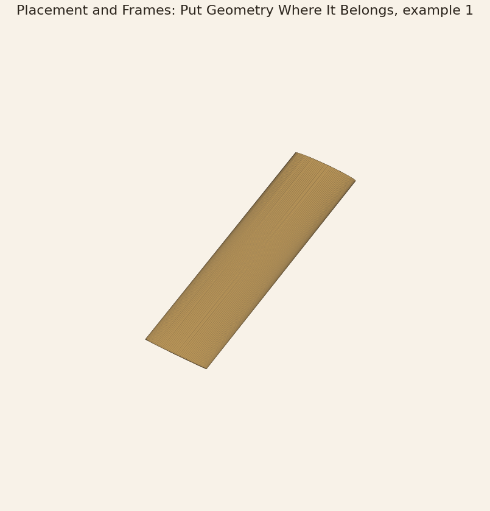

`plane` describes a local coordinate system. `place` moves geometry into it.

For path-driven models, `path-frame` can sample a location and tangent along a path. Use it when attachments must follow a curve instead of a fixed world axis.

## Verification: State What Must Stay True

`verify` stores measurable requirements with the model. Write the requirement before tuning geometry, run verification, and keep the clause unchanged while repairing a failed result.

Start with the invariant, not the fix. This model says the lid must keep at least `0.3` mm clearance above the body:

```scheme
(model
  (verify
    (tag lid_clearance body.lid_gap)
    (metric gap (clearance min-distance body lid))
    (expect gap (>= 0.3)))
  (part body (box 80 50 20))
  (part lid
    (translate 0 0 20.4
      (box 78 48 3))))
```

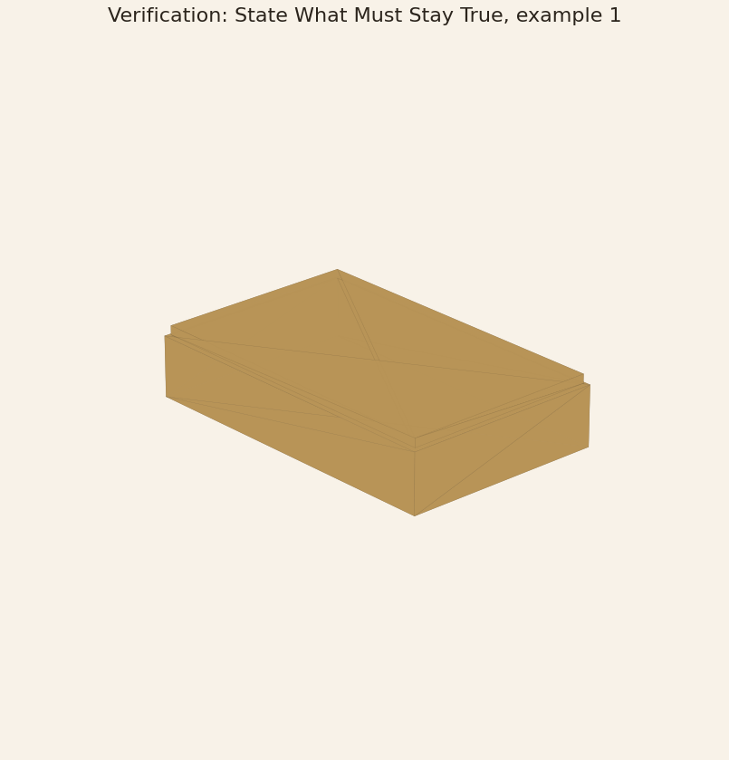

`tag` names the concern. `metric` measures it. `expect` sets the condition.

### Red to green: lid clearance

Red state: the required clearance is `0.3` mm, but the lid sits only `0.2` mm above the body. Verification reports the measured delta.

```text
(model
  (verify
    (tag lid_clearance body.lid_gap)
    (metric gap (clearance min-distance body lid))
    (expect gap (>= 0.3)))
  (part body (box 80 50 20))
  (part lid
    (translate 0 0 20.2
      (box 78 48 3))))
```

Green state: keep the same `verify` block and move the lid to `20.4`. Re-render and run verification again. Geometry changes; the requirement does not.

```text
(part lid
  (translate 0 0 20.4
    (box 78 48 3)))
```

Worked red-to-green loop:

1. Write one `verify` clause from one physical requirement.
2. Run `verify_generated_model` and confirm the failure names the violated promise.
3. Change geometry, parameters, or named constraints. Do not weaken the requirement to get green.
4. Fix the model and re-render.
5. Run `verify_generated_model` again until the original clause passes.

Use verification for:

- minimum clearances
- expected part count
- STL triangle or component checks
- required STEP or preview artifacts

Do not delete a failing verification clause to make a render pass. Fix the model or the stated requirement.

## Real Model Patterns: Procedural Cuts and Arrayed Frames

These fixtures combine generated cutter lists, deterministic fields, path frames, arrays, and parameter-driven cavities. Focus on how each model separates generation math from final boolean intent.

### Procedural perforated panel

This model uses `map` and `range` to generate cutters, `hash-signed` to jitter each cutter, `voronoi2` to vary cutter radius, and `apply union` to turn the generated list into one cutter body.

<!-- render-source: ../examples/voronoi-perforated-panel.ecky -->

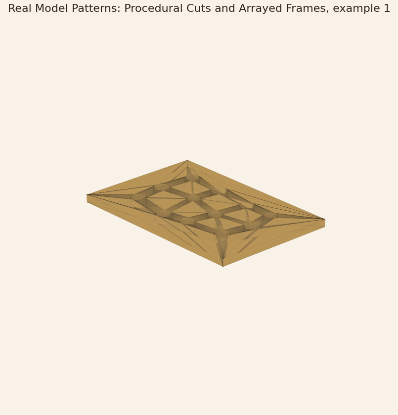

The important line is the result expression:

```scheme
(result
  (difference
    panel
    (apply union
      (map
        (lambda (cell)
          (let* ((col (- cell (* 4 (floor (/ cell 4)))))
                 (row (floor (/ cell 4)))
                 (x (* (- col 1.5) 14))
                 (y (* (- row 1.0) 12))
                 (jx (+ x (* 2.4 (hash-signed col row 23))))
                 (jy (+ y (* 2.4 (hash-signed (+ col 19.19) (+ row 7.73) 54))))
                 (r (+ 2.2 (* 1.1 (voronoi2 (/ jx 14.0) (/ jy 12.0) 23)))))
            (translate jx jy 0
              (cylinder r 8 24))))
        (range 0 cell-count)))))
```

`range` decides how many cutters exist. `map` builds one cylinder per cell. `let*` is required because `jx`, `jy`, and `r` depend on earlier bindings. `apply union` converts the list of cylinders into one boolean operand for `difference`.

This is the pattern to use when the count is parametric but the result is still one printable part.

### Frame and array bracket

This fixture combines curve-driven placement with arrays. The rib is swept along a bezier path. The pad is placed at a sampled path frame. The base holes, locator posts, and fan stops use three array helpers.

<!-- render-source: ../examples/frame-array-bracket.ecky -->

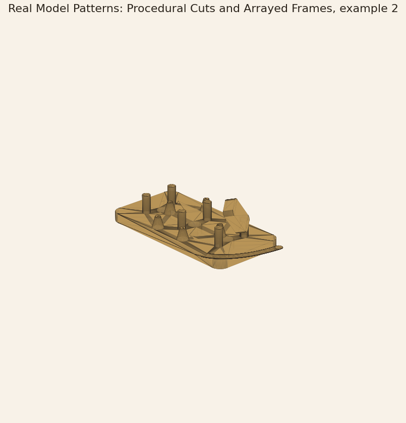

The model has three distinct placement styles:

```scheme
(shape rail
  (bezier-path ((-18 0 4) (-8 7 9) (8 -7 12) (18 0 16))))
(shape rib
  (sweep (circle 1.1) rail))
(shape end-frame
  (path-frame rail :at end :up (0 0 1)))
(shape placed-pad
  (place end-frame pad :offset (0 0 -1.5) :rotate (0 0 18)))
```

`sweep` makes geometry follow the path. `path-frame` samples a pose from the path. `place` uses that pose to attach another solid.

The array helpers do the repeated work:

```scheme
(linear-array 3 14 0 0
  (translate -14 0 -2 (cylinder 2.1 10)))

(grid-array 2 3 16 10
  (translate -16 -5 4 (cylinder 1.2 8)))

(radial-array 6 60 11
  (translate 0 0 4 (cone 1.8 0.8 5)))
```

Use these when the pattern is regular. Use `map` and `range` when each instance needs custom math.

### Woodlouse hotel

This habitat uses one generated entrance list plus repeated shelves and dividers. Shared dimensions keep openings aligned when chamber count or overall width changes.

<!-- render-source: ../examples/woodlouse-hotel.ecky -->

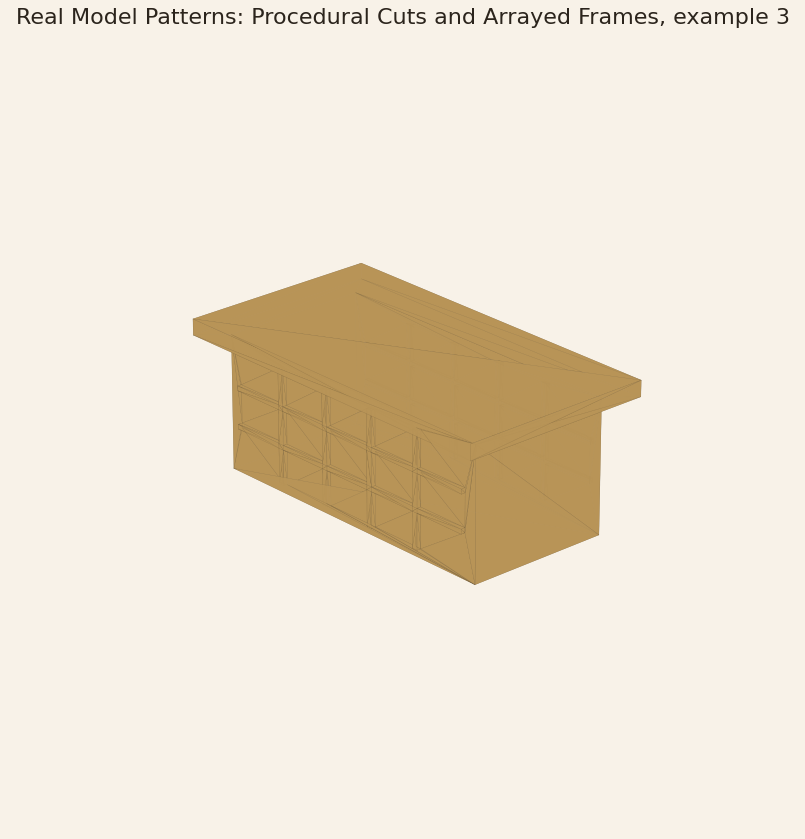

The entrances are generated from one parametric chamber count:

```scheme
(shape entrances
  (apply union
    (map
      (lambda (cell)
        (let* ((col (- cell (* chamber_cols (floor (/ cell chamber_cols)))))
               (row (floor (/ cell chamber_cols)))
               (x (+ (* -0.5 hotel_w) wall (* (+ col 0.5) col_gap)))
               (z (+ wall (* (+ row 0.55) floor_gap))))
          (translate x (* -0.5 hotel_d) z
            (rotate 90 0 0
              (cylinder entrance_r (+ hotel_d 6) 24)))))
      (range 0 (* chamber_cols 3)))))
```

`chamber_cols` drives both cutter count and divider spacing. `col_gap` is derived from `hotel_w` and `chamber_cols`, so openings stay centered when the model is resized.

## Worked Project: Perforated Toothbrush Holder

Small examples teach syntax. This project teaches control: preserve one useful
body while shelling it, closing it, proving a custom cutter, then generating
dozens of cutters without turning the source into copied geometry.

Every stage is a complete `.ecky` file. Run a checkpoint before reading the
next one with `src-tauri/target/debug/ecky check <checkpoint.ecky>`.

The manifest at
`docs/books/ecky-ir/examples/toothbrush-holder/manifest.json` keeps the stages
ordered and machine-checkable.

### Stage 1: subtract one named cavity

The outside is a union of a centered cylinder and a rear box. The cavity uses
the same construction with dimensions derived from `wall_thickness`.

```scheme
(model
  (params
    (number width 36.0 :min 20.0 :max 60.0 :label "Width")
    (number depth 25.0 :min 15.0 :max 50.0 :label "Depth")
    (number wall_thickness 2.6 :min 1.5 :max 5.0 :label "Wall thickness")
    (number height 85.0 :min 40.0 :max 150.0 :label "Height"))
  (part toothbrush_holder
    (let* ((radius (/ width 2.0))
           (inner_width (- width (* 2.0 wall_thickness)))
           (inner_depth (- depth wall_thickness))
           (inner_radius (- radius wall_thickness))
           (outer
             (union
               (box width depth height :align '(center max center))
               (cylinder radius height :align '(center center center))))
           (cavity
             (union
               (box inner_width inner_depth (+ height 10.0)
                 :align '(center max center))
               (cylinder inner_radius (+ height 10.0)
                 :align '(center center center)))))
      (difference outer cavity))))
```

Canonical checkpoint:
`docs/books/ecky-ir/examples/toothbrush-holder/01-shell.ecky`.

The cavity is taller than the body. That deliberate overrun avoids coincident
top and bottom faces. `wall_thickness` owns every fit-critical offset; there is
no second anonymous wall value waiting to drift.

### Stage 2: close the base, then reopen a drain

Stage 1 is a tube. Stage 2 adds a bottom blank at `(- (/ height 2.0))`, cuts a
drain through it, then unions the drained bottom with the shell.

```text
(bottom_blank
  (translate 0 0 (- (/ height 2.0))
    (union
      (box width depth wall_thickness :align '(center max min))
      (cylinder radius wall_thickness :align '(center center min)))))
(drain
  (translate 0 0 (- (/ height 2.0) 1.0)
    (cylinder drain_radius (+ wall_thickness 2.0)
      :align '(center center min))))
(bottom (difference bottom_blank drain))
```

Canonical checkpoint:
`docs/books/ecky-ir/examples/toothbrush-holder/02-drained-base.ecky`.

The drain begins 1 mm below the bottom and ends 1 mm above it. Cutters should
cross material completely; exact tangency is not a useful manufacturing
constraint.

### Stage 3: prove one custom cutter

The wall pattern starts as a closed `polygon`, becomes a solid with `extrude`,
then receives a frame with `location` and `place`. Only one cutter is
subtracted.

```text
(spade_profile
  (polygon
    ((0.0 4.7) (-3.05 1.5) (-3.25 -0.8) (-2.15 -1.95)
     (-0.55 -3.35) (-1.15 -5.35) (1.15 -5.35)
     (0.55 -3.35) (2.15 -1.95) (3.25 -0.8) (3.05 1.5))))
(spade
  (place
    (location (plane :origin '(0.0 0.0 0.0))
      :rotate '(-90.0 0.0 180.0))
    (extrude spade_profile cutter_depth)))
(front_cutter (translate 0.0 front_cutter_y 0.0 spade))
```

Canonical checkpoint:
`docs/books/ecky-ir/examples/toothbrush-holder/03-single-cutter.ecky`.

Do not start with the full pattern. A wrong profile, axis, or cutter depth
multiplied fifty times only makes the failure slower to understand.

### Stage 4: generate cutters, subtract once

The production model uses nested `repeat-union` forms for staggered front,
left, and right rows. Row and column indices feed local `let*` bindings for
angle, side offset, and height. Those groups become `spade_holes`.

The final intent stays small:

```text
(spade_holes (union front_spades left_spades right_spades))
(final (difference (union shell bottom) spade_holes))
```

The planner flattens the generated tool union into one n-ary `difference`, so
independent cutters can be prepared in parallel before OCCT performs the
boolean. Source still describes one semantic cut; runtime chooses the execution
schedule.

Canonical complete model:
`src-tauri/tests/fixtures/cad/perf/toothbrush_holder_versions.ecky`.

This is the reusable project shape:

**1. Expose physical controls.** Parameters describe user decisions.

**2. Derive dimensions once.** Put dependent math in `let*`.

**3. Name body and cutter stages.** Final expressions should read as intent.

**4. Prove one repeated unit.** Debug one profile, axis, and overrun.

**5. Generate the remaining units.** Use `repeat` or arrays.

**6. Keep the final boolean boring.** One body, one cutter group, one cut.

**Watch for:** a repeated cutter that only touches a wall may disappear or
split topology unpredictably. Give cutter depth explicit overrun and keep safe
top/bottom margins as named bindings.

## Final Model: Integrated Film Adapter Open Helicoid v9

The final example is a multi-part film adapter with sliding rail joints and a two-start helicoid. Its base, insert stack, tunnel, cover, and lens carrier share fit dimensions but remain separate printable parts.

<!-- render-source: ../examples/ecky-integrated-film-adapter-open-helicoid-v9.ecky -->

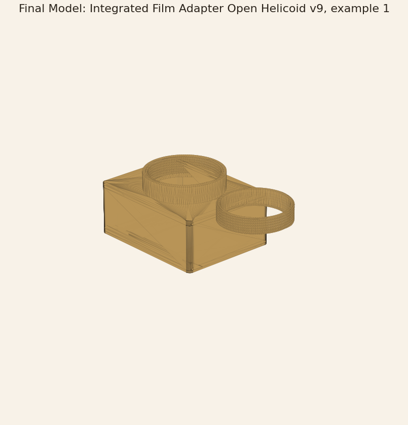

Full source: `docs/books/ecky-ir/examples/ecky-integrated-film-adapter-open-helicoid-v9.ecky`. The sections below isolate the six mechanical subsystems.

### 1. Public controls define physical fit

The first block exposes dimensions that matter after printing: film format, aperture, rail geometry, insert stack, film gap, lens bore, and helicoid thread geometry.

```scheme
(params
  (select film_format "120_645" :label "film format"
    :options (("120 6x9" "120_6x9") ("120 6x6" "120_6x6")
              ("120 6x4.5" "120_645") ("135 36x24" "135") ("110" "110")))
  (number rail_tip_w 5.4 :label "joint max W" :min 3.5 :max 8 :step 0.1)
  (number rail_h 4.2 :label "joint H" :min 2 :max 6 :step 0.1)
  (number fit_clearance 0.25 :label "fit clearance" :min 0 :max 0.8 :step 0.05)
  (number film_gap 0.6 :label "film velvet gap" :min 0.1 :max 1.5 :step 0.05)
  (number lens_bore_d 59.6 :label "lens bore D" :min 50 :max 68 :step 0.1)
  (number thread_turns 3.2 :label "helicoid turns" :min 1.5 :max 5 :step 0.1)
  (number thread_clearance 0.25 :label "helicoid clearance" :min 0.15 :max 0.6 :step 0.05))
```

This is the same habit as earlier chapters: public parameters are physical, not arbitrary. `fit_clearance` appears in rail channels and detents. `film_gap` controls the clamp stack. `lens_bore_d`, `thread_turns`, and `thread_clearance` drive the helicoid interface.

### 2. Base makes recessed pockets and male rails

The base starts as a rounded plate, removes the aperture and insert pocket, then adds male triangular rail profiles on both long sides.

```scheme
(part base_recessed_male_rails
  (build
    (shape raw_plate
      (extrude (rounded-rect outer_w outer_h corner_r) base_h))
    (shape aperture_cut
      (translate 0 0 -0.1
        (box aperture_w aperture_h (+ base_h 0.2))))
    (shape frame_pocket
      (translate 0 0 (- base_h pocket_depth)
        (extrude
          (rounded-rect (+ holder_w (* 2 fit_clearance))
                        (+ holder_h (* 2 fit_clearance))
                        holder_corner_r)
          (+ pocket_depth 0.2))))
    (shape plate
      (difference raw_plate aperture_cut frame_pocket film_path_cut))
    (shape rail_left
      (translate (- (/ outer_w 2)) rail_y rail_z
        (rotate 0 90 0
          (extrude rail_profile_pos outer_w))))
    (result
      (fuse plate rail_left rail_right detent_top_left detent_top_right
            detent_bottom_left detent_bottom_right))))
```

`rail_profile_pos` and `rail_profile_neg` are small triangular sketches. They become long rails by `extrude`, then get fused onto the base. This is the same sketch-to-extrude move from chapter 2, applied to sliding joints.

### 3. Film insert is a two-piece stack

The lower insert carries the film guides. The upper insert clamps above the film gap. Both use the selected film format to derive `frame_w`, `frame_h`, and `film_strip_w`.

```scheme
(shape frame_w
  (if (= film_format "135") 36
    (if (= film_format "110") 17
      (if (= film_format "120_645") 42
        (if (= film_format "120_6x6") 56 84)))))
(shape guide_top
  (translate 0 (/ film_channel_h 2) (- (+ holder_thickness (/ film_guide_h 2)) 0.24)
    (box (- holder_w 8) film_guide_rail_w film_guide_h)))
(shape lower_frame
  (difference
    lower_raw
    aperture_cut
    notch_top_left
    notch_top_right
    notch_bottom_left
    notch_bottom_right))
```

The insert stack is why the model has `holder_thickness`, `film_gap`, and `insert_lid_thickness` as separate controls. Those are real Z layers, not a single magic height.

### 4. Tunnel joins bottom and top modules

The tunnel module has both sides of the sliding interface. Its bottom cuts female channels so it can slide onto the base rails. Its top adds male rails so the top cover can slide onto the tunnel.

```scheme
(part tunnel_female_bottom_male_top
  (build
    (shape channel_profile_pos
      (polygon
        (((/ (+ rail_h (* 2 fit_clearance)) 2) 0)
         (0 (/ (+ rail_tip_w (* 2 fit_clearance)) 2))
         ((- (/ (+ rail_h (* 2 fit_clearance)) 2)) 0))))
    (shape body
      (difference body_blank tunnel_cut))
    (shape channel_left
      (translate (- (+ (/ outer_w 2) lead_in)) rail_y channel_z
        (rotate 0 90 0
          (extrude channel_profile_pos (+ outer_w (* 2 lead_in))))))
    (shape rail_left
      (translate (- (/ outer_w 2)) rail_y rail_z
        (rotate 0 90 0
          (extrude rail_profile_pos outer_w))))
    (result
      (fuse
        (difference body channel_left channel_right)
        rail_left
        rail_right))))
```

This is the sliding-joint core. Female channels are oversized by `fit_clearance`; male rails use the nominal profile. The book built these ideas earlier as sketches, cuts, and named clearances. Here they become a printable mechanical interface.

### 5. Top cover is open and owns the female helicoid

The cover removes matching rail channels and opens the center so the helicoid socket is visible. The female thread is modeled as two clipped helical ridges subtracted from a sleeve.

```scheme
(shape female_thread_a_raw
  (translate 0 0 (+ socket_base_z thread_z0)
    (helical-ridge
      :radius female_root_r
      :pitch thread_pitch
      :height thread_len
      :base-width female_axial_width
      :crest-width (* female_axial_width 0.58)
      :depth female_depth)))
(shape female_thread_a
  (clip-box female_thread_a_raw
    :x ((- female_thread_clip_r) female_thread_clip_r)
    :y ((- female_thread_clip_r) female_thread_clip_r)
    :z ((+ socket_base_z 0.05) (+ socket_base_z sleeve_h 1))))
(shape female_thread_b
  (rotate 0 0 180 female_thread_a))
(shape socket_threaded_shell
  (difference
    (translate 0 0 socket_base_z
      (cylinder socket_outer_r sleeve_h))
    female_thread_a
    female_thread_b))
```

`thread_pitch` comes from carrier height and turn count. `female_thread_b` is the second start, made by rotating the first. The clipped ends keep the helix printable and bounded inside the socket height.

### 6. Moving lens carrier matches the cover

The carrier is separate and previewed to the side with `carrier_preview_x`. It uses the same thread pitch, height, and clearance math, but its ridges are fused onto the carrier body instead of cut out of the socket.

```scheme
(shape male_thread_a_raw
  (translate 0 0 thread_z0
    (helical-ridge
      :radius ridge_root_r
      :pitch thread_pitch
      :height thread_len
      :base-width thread_width
      :crest-width (* thread_width 0.58)
      :depth ridge_sweep_depth)))
(shape male_thread_a
  (clip-box male_thread_a_raw
    :x ((- thread_clip_r) thread_clip_r)
    :y ((- thread_clip_r) thread_clip_r)
    :z (0 carrier_h)))
(shape carrier_outer
  (fuse carrier_body male_thread_a male_thread_b))
(result
  (translate carrier_preview_x 0 socket_base_z
    (difference carrier_outer stop_aperture lens_slip_bore)))
```

That last `translate` is preview layout, not fit math. The carrier is offset so the reader can see both halves of the helicoid in one render.

### Combined mechanism

The mechanism combines earlier patterns directly: profiles become rails and channels; named clearances control sliding fits; repeated structures stay parametric; frames place mating geometry; verification records fit requirements. The carrier threads into the cover while the remaining modules stack through rail interfaces.

## Mesh and Image Geometry: Polygons in 3D

Ecky supports typed triangle geometry alongside analytic B-rep operations. Mesh execution is bounded and deterministic; it does not run Blender Python or arbitrary scripts.

### Open surfaces and closed solids

Use `mesh` for a triangle surface. Use `polyhedron` when the triangles form a printable solid.

```scheme
(define vertices
  '((0 0 0) (20 0 0) (0 20 0) (0 0 20)))

(define triangles
  '((0 2 1) (0 1 3) (1 2 3) (2 0 3)))

(model
  (verify
    (tag mesh_clean)
    (metric bad_edges (stl non-manifold-edge-count))
    (expect bad_edges (= 0)))
  (part tetrahedron
    (polyhedron
      :vertices vertices
      :triangles triangles)))
```

`mesh` permits boundaries and previews them honestly as an open surface. `polyhedron` requires one closed orientable component with nonzero volume. Both reject invalid indices, repeated vertices, zero-area faces, duplicates, inconsistent winding, and resource-budget overflow before render.

Prefer formula-generated vertex/triangle lists for repeated or mathematical geometry. Keep one binding for each list instead of expanding thousands of copied triangles into source.

### Images use intent-level solid operations

Raster input does not introduce a separate public geometry operation. Use `extrude` for thresholded, traced artwork. Use `protrude` for continuous luminance relief. Physical dimensions remain explicit; alpha always means coverage, so transparent pixels remain empty.

```scheme
(model
  (verify
    (tag relief_closed)
    (metric bad_edges (stl non-manifold-edge-count))
    (expect bad_edges (= 0)))
  (part relief
    (protrude image-path 4
      :width 100
      :depth 70
      :foreground dark)))
```

`dark` maps `alpha * (1 - luminance)`; `light` maps `alpha * luminance`. `protrude` starts at local Z=0 and keeps only its mesh-closing epsilon below that plane. Add an authored base solid explicitly when the design needs one. The image path points to a staged local asset. Empty selection is pending, not fake geometry. Decode errors retain raw path/error evidence.

### Orthographic images become reviewed sketches

Front, Top, and Side line art follows a different route:

1. select each raster and enter physical calibration;
2. tune threshold/inversion;
3. extract closed contour candidates;
4. review a candidate into an editable sketch primitive;
5. run existing preview-hull and exact candidate validation.

Raster provenance records asset digest, view, calibration, threshold, inversion, contour id, and extractor version. Failed extraction preserves the last reviewed sketch. Preview hull remains diagnostic until STEP and hidden-line validation pass.

### Export truth follows representation

Pure mesh output offers STL. Multipart viewer assets also enable 3MF or multipart STL export. Pure mesh does not offer STEP.

A closed mesh may enter the hybrid `import-stl -> solidify` bridge before a supported BRep boolean. Successful STEP from that route is labeled **Faceted poly-BRep** and carries source mesh digests/topology evidence. It is triangle-derived, not analytic source CAD.

Reference photos are another route: a vision model can propose inferred `.ecky` source, then normal compilation and verification run. One perspective photo remains an inferred approximation; response text alone cannot mark it reconstructed or accepted CAD.


## Appendix: Language Reference

### Generated Operation Index

Documented forms and operations. Select a name to open its signature.

<!-- ECKY_GENERATED_OP_INDEX_START -->
| Form | Reference |
| --- | --- |
| [`arc-array`](#arc-array) | Array and Frame Signatures |
| [`bezier-path`](#bezier-path) | Surface and Path Signatures |
| [`box`](#box) | Primitive Signatures |
| [`bspline`](#bspline) | Surface and Path Signatures |
| [`build`](#build) | Forms and Structure |
| [`chamfer`](#chamfer) | Surface and Path Signatures |
| [`circle`](#circle) | Primitive Signatures |
| [`clip-box`](#clip-box) | Array and Frame Signatures |
| [`common`](#common) | Boolean and Transform Signatures |
| [`compound`](#compound) | Special / Custom Operations |
| [`cone`](#cone) | Primitive Signatures |
| [`cut`](#cut) | Boolean and Transform Signatures |
| [`cylinder`](#cylinder) | Primitive Signatures |
| [`define-component`](#define-component) | Components |
| [`difference`](#difference) | Boolean and Transform Signatures |
| [`extrude`](#extrude) | Surface and Path Signatures |
| [`feature`](#feature) | Forms and Structure |
| [`fillet`](#fillet) | Surface and Path Signatures |
| [`for-compound`](#for-compound) | Array and Frame Signatures |
| [`for-union`](#for-union) | Array and Frame Signatures |
| [`fuse`](#fuse) | Boolean and Transform Signatures |
| [`grid-array`](#grid-array) | Array and Frame Signatures |
| [`helical-ridge`](#helical-ridge) | Special / Custom Operations |
| [`import-stl`](#import-stl) | Primitive Signatures |
| [`intersection`](#intersection) | Boolean and Transform Signatures |
| [`linear-array`](#linear-array) | Array and Frame Signatures |
| [`location`](#location) | Array and Frame Signatures |
| [`loft`](#loft) | Surface and Path Signatures |
| [`make-face`](#make-face) | Primitive Signatures |
| [`mirror`](#mirror) | Boolean and Transform Signatures |
| [`offset`](#offset) | Surface and Path Signatures |
| [`offset-rounded`](#offset-rounded) | Surface and Path Signatures |
| [`params`](#params) | Params and Controls |
| [`part`](#part) | Forms and Structure |
| [`path`](#path) | Surface and Path Signatures |
| [`path-frame`](#path-frame) | Array and Frame Signatures |
| [`place`](#place) | Array and Frame Signatures |
| [`plane`](#plane) | Array and Frame Signatures |
| [`polygon`](#polygon) | Primitive Signatures |
| [`polyline`](#polyline) | Surface and Path Signatures |
| [`profile`](#profile) | Primitive Signatures |
| [`radial-array`](#radial-array) | Array and Frame Signatures |
| [`rectangle`](#rectangle) | Primitive Signatures |
| [`repeat`](#repeat) | Array and Frame Signatures |
| [`repeat-compound`](#repeat-compound) | Array and Frame Signatures |
| [`repeat-pick`](#repeat-pick) | Array and Frame Signatures |
| [`repeat-union`](#repeat-union) | Array and Frame Signatures |
| [`result`](#result) | Forms and Structure |
| [`revolve`](#revolve) | Surface and Path Signatures |
| [`ring`](#ring) | Primitive Signatures |
| [`rotate`](#rotate) | Boolean and Transform Signatures |
| [`rounded-polygon`](#rounded-polygon) | Primitive Signatures |
| [`rounded-rect`](#rounded-rect) | Primitive Signatures |
| [`sampled-radial-loft`](#sampled-radial-loft) | Special / Custom Operations |
| [`scale`](#scale) | Boolean and Transform Signatures |
| [`shape`](#shape) | Forms and Structure |
| [`shell`](#shell) | Surface and Path Signatures |
| [`sphere`](#sphere) | Primitive Signatures |
| [`svg`](#svg) | Primitive Signatures |
| [`sweep`](#sweep) | Surface and Path Signatures |
| [`taper`](#taper) | Surface and Path Signatures |
| [`text`](#text) | Primitive Signatures |
| [`translate`](#translate) | Boolean and Transform Signatures |
| [`twist`](#twist) | Surface and Path Signatures |
| [`union`](#union) | Boolean and Transform Signatures |
| [`wall-pattern`](#wall-pattern) | Special / Custom Operations |
| [`xor`](#xor) | Boolean and Transform Signatures |
<!-- ECKY_GENERATED_OP_INDEX_END -->

## Language Overview

Scope here:

- `ecky/cad` exported CAD forms and ops
- `ecky/core` helper functions shipped with Ecky
- `ecky/params` parameter forms
- lowerer-visible keywords people otherwise guess from source

Out of scope here:

- full Steel standard library reference
- backend implementation internals
- UI behavior outside `.ecky` authoring

Mental model:

- `.ecky` is Scheme surface syntax
- compiler lowers it into Core IR
- verifier checks value kinds and op signatures
- native execution maps Core IR into `OcctPlan`, then the precompiled Direct OCCT runner; FreeCAD lowering is optional interop

Read this order if new:

- `Forms and Structure`
- `Params and Controls`
- `Primitive Signatures`
- `Boolean and Transform Signatures`
- `Surface and Path Signatures`
- `Array and Frame Signatures`
- `Special / Custom Operations`
- `Selector Strings and Named Keywords`

## Forms and Structure

This is top-level authoring grammar. If source feels mysterious, start here.

### `model`

```scheme
(model
  ...)
```

- root form for one design
- source must start with `(model ...)`
- accepts the direct clauses listed in `Complete Compiler Surface`: `params`,
  `verify`, `part`, `feature`, topology tags, `view`, and `analysis`
- reusable helper `define`s and `define-component` declarations belong before
  `(model ...)`; derived values depending on model params belong in `let*`

### `part`

```scheme
(part body expr)
(part body "Human Label" expr)
```

- positional 1: part id symbol
- positional 2: optional display label text
- final positional: expression producing geometry

### `feature`

Two forms exist:

```scheme
(feature body :role shell expr)
(feature body :role shell :params (width height) expr)
```

- positional 1: feature id symbol
- required keyword: `:role`
- optional keyword: `:params`
- final positional: expression producing geometry

Use `feature` when geometry needs explicit semantic identity, role, and parameter-key tracking.

### `build`

```scheme
(build
  (shape outer expr)
  (shape cavity expr)
  (result expr))
```

- local binding block
- accepts `shape` bindings plus one `result`
- `result` must come once
- do not place new `shape` bindings after `result`

### `shape`

```scheme
(shape ribs expr)
```

`shape` is not geometry op. It is bind statement inside `build`.

- positional 1: local binding name
- positional 2: expression producing value

Read it as:

- bind intermediate value
- give later code a name
- keep boolean stacks readable

### `result`

```scheme
(result expr)
```

- final value returned by `build`

### `assembly` (planned)

Reserved shape sketch:

```scheme
(model
  (assembly exploded_preview
    ...))
```

- planned top-level clause for explicit multi-part assembly recipes
- spelling reserved in book now; runtime/compiler support deferred
- spec'd grammar reserved now; implementation deferred until views prove the display/manufacturing split
- intended to formalize what component packages already do at the package layer
- assemblies stay placement-based as today; no mate/joint solver implied
- examples here mark intent only, not accepted source today
- until implementation lands, keep physical bodies as `part`s, use `view` for preview-only offsets, and use component packages for solved assembly workflows

### `export` (planned)

Reserved shape sketch:

```scheme
(model
  (export manufacturing
    ...))
```

- planned top-level clause for authored export/manufacturing policy
- spelling reserved in book now; runtime/compiler support deferred
- reserved until views prove the display/manufacturing split
- preview transforms never affect STL or STEP artifacts
- examples here mark intent only, not accepted source today
- until implementation lands, use current export commands, artifact manifests, and package output modes outside `.ecky` source

## Components

A component is a named, parameterized, closed geometry unit. Define once,
instantiate anywhere, override knobs at the call site. `model` and `part`
stay valid forever; components add reuse on top without changing them.

### `define-component`

```scheme
(define-component knuckle
  ((number pin_d 8 :label "Pin diameter" :min 4 :max 12 :step 0.5)
   (number clearance 0.3))
  (difference
    (cylinder (* 2 pin_d) 10 96)
    (cylinder (+ pin_d clearance) 12 96)))
```

- positional 1: component name symbol
- positional 2: signature list; entries use the same grammar as `params`
  entries (kind, key, optional default, keyword metadata)
- final positional: one geometry expression
- optional `(verify ...)` clauses may sit alongside the geometry expression
- declaration is top-level, before `(model ...)`

### Instantiation

```scheme
(part hinge_a (knuckle :pin_d 6))   ; override pin_d, clearance defaults
(part hinge_b (knuckle))            ; all defaults apply
```

- arguments are keywords only: `(name :key value ...)`
- omitted keys take their signature defaults
- a signature entry without a default is required at every call site
- unknown keyword or missing required key fails compile with the component
  name and its signature listed
- components instantiate other components; cycles are rejected and nesting
  is capped at depth 32

### Closedness

A component body sees its signature keys plus bindings made inside the body
(`let`, `let*`, lambda parameters, `repeat` indices, `build` shapes) and
nothing else. Referencing a model param or outer binding is a compile error
naming the variable and the component. Closedness is what makes a component
copy-inlineable: paste the `define-component` into any model and it works.

### Verify travel

`verify` clauses inside a component expand once per instantiation, with the
tag namespaced by the instantiating part key:

```scheme
(define-component pin ((number d 2))
  (verify (tag pin_ok) (metric min_wall_thickness "body") (expect (>= value 1)))
  (cylinder d 10 48))

(part left (pin :d 3))   ; verify tag becomes left/pin_ok
```

A pasted component therefore carries its own checks — reuse includes proof.

### Component Library Workflow (MCP)

Agents lift proven parts into the shared library and reuse them by source:

1. `component_extract` — pass the model source and a `partKey`. Referenced
   model params become the signature with metadata preserved; scalar outer
   `let`/`let*` bindings become plain defaults; non-scalar free references
   are reported as blockers. Set `save: true` to store the component.
2. `component_search` — compact headers only (name, one-liner, param keys,
   tags). Bodies are never returned by search.
3. `component_get` — full copy-inline `define-component` source for one
   component by name. Paste it into the model and instantiate it.

Extraction is copy-inline only: the returned source is self-contained and
no registry reference is created implicitly.

### Live package references

Use a live reference when the authored model must retain an installed package
coordinate instead of vendoring source:

```scheme
(import-component
  "bike.bottle-holder-kit"
  :version "1.2.0"
  :component "bottle-cage"
  :as cage)

(model
  (part holder
    (cage :diameter 74)))
```

Package id, version, component id, and alias are mandatory literal values.
Resolution is exact. No semver ranges, `latest`, network fallback, or
transitive package lookup occurs.

Copy-inline and live reference are separate modes:

- `component_get` is vendor mode: paste closed source; no package dependency
  or dependency lock exists afterward.
- `import-component` is live mode: the committed model version owns a
  canonical exact lock containing package coordinates and payload digests.
- preview, render, export, reopen, and historical rerender read the appended
  lock and never update it.
- installing a newer package changes nothing until an explicit upgrade
  previews and appends a new model version. The old version keeps its old lock.

Payloads live once in the application-global content-addressed store. Models
do not receive `node_modules`-style dependency trees. Uninstall removes package
discovery; committed locks continue resolving their immutable payload digests.
Garbage collection removes a payload only after installed coordinates,
committed versions, and in-flight operations stop retaining it.

Filesystem projects mirror the canonical lock as `ecky.lock.edn`. Normal
export references the global store. Portable export vendors locked payloads by
digest; portable import verifies every digest before publishing anything.

STEP-backed live components preserve analytic BRep provenance and import
through native Direct OCCT. This path never calls FreeCAD, converts through
STL, invokes `solidify`, repairs geometry, or implicitly fuses multiple roots.
STL remains the separate `import-stl` → `solidify` mesh bridge.

## Verify Clauses

Use `verify` when source should declare structural expectations explicitly.

```scheme
(model
  (verify
    (tag front_gap body.front_window_1)
    (intent "Keep lid clearance printable")
    (severity error)
    (when assembly-preview)
    (metric gap (clearance min-distance body lid))
    (expect gap (>= 3)))
  (part body (box 10 10 10))
  (part lid (box 10 10 10)))
```

- model verification is top-level under `model`
- component-owned verification is the one exception: a `verify` clause may
  sit directly inside `define-component`, before its geometry expression, and
  expands once per instance
- one verify clause requires exactly one `tag`, `metric`, and `expect`
- optional `intent`, `severity`, and `when` sections may each appear once
- sections may be authored in any order; emitted source uses `tag`, `intent`,
  `severity`, `when`, `metric`, `expect`
- nested `verify` inside geometry or helper expressions is rejected
- empty `(verify)` is rejected

### `tag`

```scheme
(tag body_shell body.front_window_1)
```

- carries authored labels, ids, or references
- payload stays opaque to compiler/core IR
- useful for human grouping and later diagnostics

### `intent`

```scheme
(intent "Assembly must remain connected")
```

- optional human explanation of the invariant
- does not create a second requirement id; `tag` remains stable identity

### `severity`

```scheme
(severity error)
(severity warning)
```

- omission means `error`
- a failed `error` expectation blocks structural verification
- a failed `warning` expectation stays visible but does not make the model red
- invalid syntax, invalid conditions, and evaluation errors always block;
  `warning` cannot hide a broken check

### `when`

```scheme
(when assembly-preview)
(when (and assembly-preview (not print-layout)))
```

- optional boolean gate evaluated from effective render parameters
- accepts booleans, boolean parameter names, and nested `not`, `and`, `or`
- false returns explicit `skipped` evidence; metric and expectation do not run
- unknown/non-boolean parameters, bad arity, and unknown operators are errors

### `metric`

```scheme
(metric check (manifest has-step))
(metric triangles (stl triangle-count))
(metric gap (clearance min-distance body.front_window_1 lid.front_skirt))
```

- first item usually names local check alias
- second item is metric expression
- current runtime metric namespaces:
  - `manifest`
  - `stl`
  - `clearance`

Current shipped metric keys:

- `manifest has-step`
- `manifest has-model-stl`
- `manifest edge-target-count`
- `manifest face-target-count`
- `manifest export-format-count`
- `manifest part-count`
- `stl triangle-count`
- `stl connected-component-count`
- `stl non-manifold-edge-count`
- `stl overhang-face-count`
- `stl bed-contact-area-ratio [part-id]`
- `stl bed-contact-x-span-ratio [part-id]`
- `stl bed-contact-y-span-ratio [part-id]`
- `clearance min-distance`

Bed-contact ratios compare downward planar faces touching the lowest Z plane
against all downward planar faces. Area ratio catches models whose nominal
bottom is mostly suspended. X/Y span ratios catch models resting only on one
small island, edge, or corner. Pass an optional part id to analyze that part's
STL instead of the combined model STL.

`clearance min-distance` compares the minimum distance between two named
selectors.

- selectors can name parts, selection targets, or correspondence outputs
- part selectors use manifest bounds
- edge and face selectors use runtime mesh target geometry when available
- unresolved selectors fail authored verify with a raw runtime error

### `expect`

```scheme
(expect check (= true))
(expect triangles (> 100))
```

- first item should reference the metric alias used above
- second item is comparator form
- current shipped comparators:
  - `=`
  - `>`
  - `>=`
  - `<`
  - `<=`

Authoring rule:

- fix geometry or exports until `verify` passes
- do not remove `verify` clauses to bypass authored requirements

## Params and Controls

Parameter forms live in `ecky/params`.

### `params`

```scheme
(params
  decl
  decl
  :relations ((<= wall shell) (>= shell 1.6)))
```

- container for parameter declarations
- optional `:relations` list attaches cross-parameter constraints

Supported relation operators:

- `<`
- `<=`
- `>`
- `>=`

### `number`

```scheme
(number wall 2.4
  :label "Wall"
  :min 0.8
  :max 8
  :step 0.1
  :unit length
  :frozen #f)
```

- positional 1: parameter key symbol
- positional 2: default number
- keywords:
  - `:label` text
  - `:min` number
  - `:max` number
  - `:step` number
  - `:unit` one of `length | angle | ratio | count | text`
  - `:frozen` boolean

### Units and suffixed literals

Humans may use bare numbers because Ecky's base units are millimetres and
degrees. Agent-generated physical dimensions should use suffixed literals like
mm/cm/in/deg/rad when the suffix makes intent clearer.

Examples:

- `12mm`
- `2.54cm`
- `0.25in`
- `45deg`
- `1.5708rad`

Prompt generators use suffixed literals for physical lengths and angles. Bare
numbers remain appropriate for counts, ratios, segments, and unitless math.

### `toggle`

```scheme
(toggle useFillet #t
  :label "Use fillet"
  :frozen #f)
```

- positional 1: parameter key symbol
- positional 2: default boolean
- keywords:
  - `:label`
  - `:frozen`

### `select`

```scheme
(select material "PLA"
  :label "Material"
  :unit text
  :options
    ((option "PLA" "PLA")
     (option "PETG" "PETG")
     (option "ABS" "ABS"))
  :frozen #f)
```

- positional 1: parameter key symbol
- positional 2: default choice value
- required keyword for practical use: `:options`
- optional keywords:
  - `:label`
  - `:unit`
  - `:frozen`

### `image`

```scheme
(image decal "assets/logo.svg"
  :label "Decal"
  :frozen #f)
```

- positional 1: parameter key symbol
- positional 2: default image path text
- optional keywords:
  - `:label`
  - `:frozen`

### `option`

```scheme
(option "Large" 42)
(option "PLA" "PLA")
```

- positional 1: display label
- positional 2: value
- valid value kinds:
  - number
  - string / text symbol

## Core Helper Library

Helpers here come from `ecky/core`.

### Constructors and Symbols

#### `vec2`

- signature: `vec2 x y`
- returns: 2D point

#### `vec3`

- signature: `vec3 x y z`
- returns: 3D point

#### `start`

- constant anchor symbol for path/frame usage

#### `end`

- constant anchor symbol for path/frame usage

#### `xy`

- constant plane symbol

#### `yz`

- constant plane symbol

#### `xz`

- constant plane symbol

#### `true`

- constant boolean alias for `#t`

#### `false`

- constant boolean alias for `#f`

### Sequence Helpers

#### `zip`

- signature: `zip list1 list2 ...`
- returns: list of tuples

#### `enumerate`

- signature: `enumerate list`
- signature: `enumerate start-index list`
- returns: list of `(index item)` pairs

#### `flat-map`

- signature: `flat-map fn list1 list2 ...`
- returns: concatenated mapped list

#### `concat-map`

- signature: `concat-map fn list1 list2 ...`
- same behavior as `flat-map`

#### `linspace`

- signature: `linspace start stop count`
- returns: evenly spaced number list
- special cases:
  - `count <= 0` -> empty list
  - `count == 1` -> single-item list containing `start`

### Scalar Math Helpers

#### `pi`

- constant `3.141592653589793`

#### `tau`

- constant `6.283185307179586`

#### `clamp`

- signature: `clamp value lower upper`
- returns: value clamped into `[lower, upper]`

#### `lerp`

- signature: `lerp start end t`
- returns: linear interpolation

#### `invlerp`

- signature: `invlerp start end value`
- returns: normalized interpolation factor

#### `remap`

- signature: `remap value in-start in-end out-start out-end`
- returns: value remapped from one range into another

#### `deg`

- signature: `deg degrees`
- returns: radians

#### `rad`

- signature: `rad radians`
- returns: degrees

#### `deg->rad`

- signature: `deg->rad degrees`
- returns: radians

#### `rad->deg`

- signature: `rad->deg radians`
- returns: degrees

#### `smoothstep`

- signature: `smoothstep edge0 edge1 x`
- returns: smoothed `0..1` interpolation

#### `square`

- signature: `square x`
- returns: `x * x`

#### `cube`

- signature: `cube x`
- returns: `x * x * x`

### Noise and Field Helpers

#### `hash01`

- signature: `hash01 x y seed`
- returns: deterministic `0..1` scalar

#### `hash-signed`

- signature: `hash-signed x y seed`
- returns: deterministic `-1..1` scalar

#### `noise2`

- signature: `noise2 x y seed`
- returns: smoothed 2D value noise

#### `fbm2`

- signature: `fbm2 x y seed octaves lacunarity gain`
- returns: fractal Brownian motion sample

#### `voronoi2`

- signature: `voronoi2 x y seed`
- returns: Voronoi-style scalar field

#### `cell-distance2`

- signature: `cell-distance2 x y seed`
- returns: normalized cell distance field

#### `jitter2`

- signature: `jitter2 x y amount seed`
- returns: jittered 2D point

#### `jittered-grid`

- signature: `jittered-grid rows cols dx dy amount seed`
- returns: list of jittered 2D points

### Shape-Driving Point Generators

#### `polar-points`

- signature: `polar-points count radius`
- returns: closed-style circular 2D sample list

#### `organic-loop`

- signature: `organic-loop count radius amount seed`
- returns: noisy radial 2D loop

#### `wave-loop`

- signature: `wave-loop count rx ry amp waves seed`
- returns: wavy ellipse-like 2D loop

#### `superellipse-point`

- signature: `superellipse-point rx ry n t`
- returns: single 2D point on superellipse

#### `voronoi-cells`

- signature: `voronoi-cells rows cols dx dy amount seed`
- returns: jittered cell-center point list

### Chaotic / Generative Point Clouds

#### `lorenz-points`

- signature: `lorenz-points count dt scale`
- returns: list of 3D points

#### `rossler-points`

- signature: `rossler-points count dt scale`
- returns: list of 3D points

#### `logistic-bifurcation-points`

- signature: `logistic-bifurcation-points count seed scale`
- returns: list of 2D points

#### `henon-points`

- signature: `henon-points count seed scale`
- returns: list of 2D points

Use helper outputs as inputs to `polygon`, `bspline`, `path`, `bezier-path`, `map`, and repetition logic.

## Value Kinds and IR Nodes

Verifier-backed value kinds:

- `Any`
- `Number`
- `Boolean`
- `Text`
- `List`
- `Point2`
- `Point3`
- `Sketch`
- `Path`
- `Frame`
- `Compound`
- `Solid`

Core node kinds:

- `Literal`
- `Reference`
- `Build`
- `Let`
- `If`
- `Call`
- `Range`
- `Map`
- `Apply`
- `List`
- `Group`

If typecheck fails, compiler is checking these kinds, not backend Python text.

## Primitive Signatures

These are explicit authored calls. When backend diverges, caveat is spelled out.

### `box`

- signature: `box width depth height`
- result: `Solid`
- keywords:
  - `:align (x y z)` with each axis one of `min | center | max`

### `sphere`

- signature: `sphere radius`
- result: `Solid`
- keywords:
  - `:align (x y z)`

### `cylinder`

- signature: `cylinder radius height`
- signature: `cylinder radius height segments`
- result: `Solid`
- keywords:
  - `:align (x y z)`

### `cone`

- signature: `cone radius1 radius2 height`
- signature: `cone radius1 radius2 height segments`
- result: `Solid`
- keywords:
  - `:align (x y z)`

### `circle`

- signature: `circle radius`
- signature: `circle radius segments`
- result: `Sketch`

### `rectangle`

- signature: `rectangle width height`
- result: `Sketch`

### `rounded-rect`

- signature: `rounded-rect width height radius`
- result: `Sketch`

### `rounded-polygon`

- signature: `rounded-polygon points radius`
- signature: `rounded-polygon points radius segments`
- `points`: list of 2D points
- result: `Sketch`

### `polygon`

- signature: `polygon points`
- `points`: list of 2D points
- result: `Sketch`

### `profile`

- signature: `profile loop1 loop2 ...`
- signature: `profile :outer outer-loop :holes hole-loop-or-list`
- result: `Sketch`

Rules:

- positional form treats every argument as sketch/wire loop
- keyword form accepts `:outer` and `:holes` only
- current hole-aware lowerers expect exactly one outer loop when `:holes` is used

### `make-face`

- signature: `make-face wire1 wire2 ...`
- result: `Sketch`
- use when you already have wire-like geometry and need face/sketch result

### `text`

- signature: `text string size [:font selector]`
- result: `Sketch`
- normal use: feed into `extrude`
- `:font` belongs to `text`, not `extrude`
- `selector` accepts an installed font family name or an absolute `.ttf`/`.otf` path
- a literal selector changes one call; a shared `select` parameter can drive several calls

Example:

```scheme
(extrude (text "HELLO" 12 :font "Arial") 2)
```

One label only:

```scheme
(union
  (extrude (text "MORNING" 12 :font "Arial") 2)
  (translate 0 20 0
    (extrude (text "EVENING" 12 :font "Impact") 2)))
```

Shared parameter:

```scheme
(model
  (params
    (select label-font "Arial" :label "Label Font"
      :options (("Arial" "Arial") ("Impact" "Impact"))))
  (part labels
    (extrude (text "HELLO" 12 :font label-font) 2)))
```

### `svg`

- native signature: `svg path`
- FreeCAD interop signature: `svg path [target-width] [target-height] [fit-mode]`
- result: `Sketch`

Known fit modes from lowerers/tests:

- `"contain"`
- `"cover"`
- `"stretch"`
- `"fill"`

### `import-stl`

- signature: `import-stl path`
- result: imported solid/mesh-like geometry

### `ring`

- signature: `ring outer-radius inner-radius`
- signature: `ring outer-radius inner-radius segments`
- result: `Sketch`
- lowering behavior: alias for profile-with-hole semantics

## Boolean and Transform Signatures

### `union`

- signature: `union shape1 shape2 ...`
- result: shape-like value

### `fuse`

- alias of `union`

### `difference`

- signature: `difference base cut1 cut2 ...`
- result: shape-like value

### `cut`

- alias of `difference`

### `intersection`

- signature: `intersection shape1 shape2 ...`
- result: shape-like value

### `common`

- alias of `intersection`

### `xor`

- signature: `xor shape1 shape2 ...`
- result: shape-like value

Boolean rule:

- minimum arity: one shape

### `translate`

- signature: `translate x y z shape`
- result kind follows input shape kind

### `rotate`

- signature: `rotate x y z shape`
- result kind follows input shape kind

### `scale`

- verifier accepts:
  - `scale factor shape`
  - `scale x y z shape`
- native planner supports both forms
- FreeCAD lowerer currently expects explicit `x y z shape`
- result kind follows input shape kind

### `mirror`

- signature: `mirror axis offset shape`
- `axis`: string or symbol naming mirror axis
- `offset`: numeric plane offset
- result kind follows input shape kind

Examples:

```scheme
(translate 20 0 0 (box 10 10 10))
(rotate 0 0 45 (box 10 10 10))
(scale 2 2 1 (circle 10))
(mirror 'x 0 (box 10 10 10))
```

## Surface and Path Signatures

### `extrude`

- signature: `extrude profile distance`
- result: `Solid`
- backend keyword:
  - `:symmetric` boolean

### `revolve`

- signature: `revolve profile angle`
- result: `Solid`

### `loft`

- signature: `loft distance profile1 profile2 ...`
- requires at least two profiles after distance
- result: `Solid`

### `sweep`

- signature: `sweep profile path`
- result: `Solid`

Example:

```scheme
(model
  (part rail
    (sweep
      (circle 1.2)
      (bezier-path ((0 0 0) (0 0 12) (12 0 20) (24 0 20))))))
```

The circle is the cross-section. The Bézier path carries it upward, then
through the bend, producing a capped solid rail.

### `shell`

- signature: `shell thickness solid`
- result: `Solid`
- optional keyword:
  - `:faces selector`

### `offset`

- signature: `offset amount profile`
- result: `Sketch`
- optional keyword:
  - `:openings sketch-or-sketch-list`

### `offset-rounded`

- signature: `offset-rounded amount profile`
- result: `Sketch`
- optional keyword:
  - `:openings sketch-or-sketch-list`

### `fillet`

- signature: `fillet radius solid`
- result: `Solid`
- optional keyword:
  - `:edges selector`

### `chamfer`

- signature: `chamfer distance solid`
- result: `Solid`
- optional keyword:
  - `:edges selector`

### `taper`

- signature: `taper height scale profile`
- signature: `taper height scale-x scale-y profile`
- result: `Solid`
- FreeCAD caveat: non-uniform taper currently rejected

### `twist`

- signature: `twist height angle profile`
- result: `Solid`
- verifier-backed form is 3 positional args

### `path`

- signature: `path point1 point2 ...`
- signature: `path point-list`
- each point is 3D
- result: `Path`

### `polyline`

- alias of `path`

### `bezier-path`

- signature: `bezier-path point-list`
- point list must be 3D
- result: `Path`

### `bspline`

- signature: `bspline point-list`
- optional second positional in lowerers: `closed`
- optional keywords:
  - `:closed` boolean
  - `:tangents` point-list
  - `:tangent-scalars` numeric list
- result: `Sketch`

Notes:

- verifier only requires point-list first
- lowerers accept tangent hints
- tangents list may use 2 entries or one per point in native path

Example:

```scheme
(model
  (part body
    (extrude
      (bspline
        ((-14 -8) (-8 -14) (8 -14) (14 -8)
         (14 8) (8 14) (-8 14) (-14 8))
        :closed #t)
      4)))
```

## Array and Frame Signatures

### `linear-array`

- signature: `linear-array count x y z shape`
- result: same geometry family as input

### `radial-array`

- signature: `radial-array count angle radius shape`
- result: same geometry family as input

### `grid-array`

- signature: `grid-array rows cols x y shape`
- result: same geometry family as input

### `arc-array`

- signature: `arc-array count radius start-angle end-angle shape`
- result: same geometry family as input

### `repeat`

- signature: `repeat index count expr`
- verifier recognizes form
- geometry lowerers do not currently expose dedicated authored lowering path like `repeat-union` / `repeat-compound` / `repeat-pick`

### `repeat-union`

- signature: `repeat-union index count expr`
- index must be symbol
- body should produce geometry
- result: union/fused geometry

### `repeat-compound`

- signature: `repeat-compound index count expr`
- index must be symbol
- body should produce geometry
- result: compound geometry
- native caveat: currently solid-only

### `repeat-pick`

- signature: `repeat-pick index count predicate expr`
- index must be symbol
- predicate decides whether current body instance is selected
- result: last matching geometry

### `for-union`

- macro alias:
  - `for-union (index count) body`
- lowers to `repeat-union`

### `for-compound`

- macro alias:
  - `for-compound (index count) body`
- lowers to `repeat-compound`

### `plane`

- signature: `plane`
- keywords:
  - `:origin (x y z)`
  - `:x (x y z)`
  - `:normal (x y z)`
- result: `Frame`

Defaults:

- origin `(0 0 0)`
- x direction `(1 0 0)`
- normal `(0 0 1)`

### `location`

- verifier signature: `location [frame]`
- authored backend-safe signature: `location frame`
- optional keywords:
  - `:offset (x y z)`
  - `:rotate (x y z)`
- result: `Frame`

### `path-frame`

- signature: `path-frame path`
- optional keywords:
  - `:at start | end | number`
  - `:up (x y z)`
- result: `Frame`

### `place`

- signature: `place frame shape`
- optional keywords:
  - `:offset (x y z)`
  - `:rotate (x y z)`
- result: placed shape

### `clip-box`

- signature: `clip-box shape`
- required keywords:
  - `:x (min max)`
  - `:y (min max)`
  - `:z (min max)`
- result: clipped shape

Example:

```scheme
(model
  (part body
    (build
      (shape rail (path (0 0 0) (20 0 10) (20 10 10)))
      (shape peg (box 4 2 6 :align '(min min min)))
      (shape frame (path-frame rail :at 0.5))
      (result (place frame peg :offset (1 2 3) :rotate (10 20 30))))))
```

## Special / Custom Operations

These are exported authored ops outside generic primitive/boolean/surface families.

### `hole`

Typed placeholder op. Use to mark missing geometry intentionally.

- signature: `hole :type kind`
- signature: `hole :type kind :goal "why this hole exists"`
- required keyword:
  - `:type`
- optional keyword:
  - `:goal`

Allowed `:type` values:

- `solid`
- `sketch`
- `path`
- `shape`

Current behavior:

- compiler accepts it as typed placeholder
- lowerers reject it until replaced with real geometry

### `compound`

- signature: `compound shape1 shape2 ...`
- groups shapes without boolean merge semantics

### `helical-ridge`

Keyword-only thread-like ridge generator.

- required keywords:
  - `:radius`
  - `:pitch`
  - `:height`
  - `:base-width`
  - `:crest-width`
  - `:depth`
- optional keywords:
  - `:female`
  - `:clearance`
  - `:lefthand`

Example:

```scheme
(helical-ridge
  :radius 10
  :pitch 2
  :height 18
  :base-width 1.2
  :crest-width 0.4
  :depth 0.7
  :female #t
  :clearance 0.15
  :lefthand #t)
```

### `sampled-radial-loft`

Procedural sampled shell / loft op.

```scheme
(sampled-radial-loft
  (theta z fz)
  :height 40
  :z-steps 6
  :theta-steps 24
  :radius expr
  :z-map expr)
```

- binder list must be exactly `(theta z fz)`
- required keywords:
  - `:height`
  - `:z-steps`
  - `:theta-steps`
  - `:radius`
- optional keyword:
  - `:z-map`

### `wall-pattern`

Pattern op applied to shell/solid target.

Pattern shape seen in repo:

```scheme
(wall-pattern
  (:mode gyroid :depth 0.6 :uFreq 4 :vFreq 5 :phase 0.2)
  shape)
```

Observed options:

- `:mode`
- `:depth`
- `:uFreq`
- `:vFreq`
- `:phase`

Observed modes:

- `gyroid`
- `cellular`
- `fbm`
- `ribs`

Backend caveat:

- native OCCT handles BREP operations; `wall-pattern` remains mesh-only

## Selector Strings and Named Keywords

This is where people waste time guessing.

### Shared keyword value expectations

Verifier enforces:

- `:offset` -> 3D point
- `:rotate` -> 3D point
- `:origin` -> 3D point
- `:x` -> 3D point on frame ops
- `:normal` -> 3D point
- `clip-box :x/:y/:z` -> 2-item numeric list
- `:openings` -> sketch or sketch-list
- `:edges` -> edge selector payload
- `:faces` -> face selector payload

### `:align`

Supported on:

- `box`
- `sphere`
- `cylinder`
- `cone`

Example:

```scheme
(box 4 4 4 :align '(min center max))
```

Rules:

- expects 3-axis tuple
- each axis must be `min`, `center`, or `max`

### Edge selectors

Used by ops like `fillet` and `chamfer`.

Examples:

- `:edges top`
- `:edges "bottom"`
- `:edges "left+vertical"`
- `:edges "target-id:body:edge:0:0-0-0_10-0-0"`

Observed canonical meaning:

- `top` -> boundary `z max`
- `bottom` -> boundary `z min`
- `left+vertical` -> `x-min + axis-z`

### Face selectors

Used by ops like `shell`.

Examples:

- `:faces "top"`
- `:faces "planar+normal-z+area-max"`
- `:faces "target-id:body:face:5:0-0-10:100"`

### `path-frame :at`

Accepted anchor values:

- `start`
- `end`
- numeric position

## Bound Project Lifecycle

- When target metadata supplies `sourcePath`, edit that exact file. `sourceFolder`
  is its workspace; `sourceState` reports clean, pending, or failed source.
- The folder watcher waits for a settled edit, appends one version, validates,
  renders a preview, and records status. Read raw diagnostics before success claims.
- Do not export over bound source, write history storage directly, or invent a
  commit/finalize step. Compatibility buffers apply only without `sourcePath`.

## Complete Compiler Surface

Generated from the same Rust registry used by MCP manifests and agent prompts.
Do not edit rows by hand; run `npm run generate:prompt`.

<!-- ECKY_GENERATED_SURFACE_REFERENCE_START -->
| Form | Kind | Signature | Backends | Description | Example |
| --- | --- | --- | --- | --- | --- |
| `*` | numericHelper | `(* a b...)` | freecad, legacy-build123d, mesh/native | Multiplies numbers. | `(* radius 2)` |
| `+` | numericHelper | `(+ a b...)` | freecad, legacy-build123d, mesh/native | Adds numbers. | `(+ width clearance)` |
| `-` | numericHelper | `(- a b...)` | freecad, legacy-build123d, mesh/native | Subtracts numbers or negates one number. | `(- outer inner)` |
| `/` | numericHelper | `(/ a b...)` | freecad, legacy-build123d, mesh/native | Divides numbers. | `(/ width 2)` |
| `<` | booleanHelper | `(< a b)` | freecad, legacy-build123d, mesh/native | Boolean predicate or comparator for conditionals and filtering. | `(< 2 1)` |
| `<=` | booleanHelper | `(<= a b)` | freecad, legacy-build123d, mesh/native | Boolean predicate or comparator for conditionals and filtering. | `(<= 2 1)` |
| `=` | booleanHelper | `(= a b)` | freecad, legacy-build123d, mesh/native | Boolean predicate or comparator for conditionals and filtering. | `(= 2 1)` |
| `>` | booleanHelper | `(> a b)` | freecad, legacy-build123d, mesh/native | Boolean predicate or comparator for conditionals and filtering. | `(> 2 1)` |
| `>=` | booleanHelper | `(>= a b)` | freecad, legacy-build123d, mesh/native | Boolean predicate or comparator for conditionals and filtering. | `(>= 2 1)` |
| `abs` | numericHelper | `(abs value)` | freecad, legacy-build123d, mesh/native | Returns absolute value. | `(abs offset)` |
| `analysis` | modelClause | `(analysis id analysis-clause...)` | freecad, legacy-build123d, mesh/native | Declares an authored FEM/engineering analysis contract tied to model parts and selector tags. | `(analysis load-case (linear-static :part body) (fixed :face-tag mounting) (solve :method direct))` |
| `and` | booleanHelper | `(and value...)` | freecad, legacy-build123d, mesh/native | Boolean predicate or comparator for conditionals and filtering. | `(and true false)` |
| `append` | expressionForm | `(append list...)` | freecad, legacy-build123d, mesh/native | Concatenates lists. | `(append front-points back-points)` |
| `apply` | expressionForm | `(apply fn args)` | freecad, legacy-build123d, mesh/native | Calls a function with arguments from a list. | `(apply union cutters)` |
| `arc-array` | cadOp | `(arc-array count radius start-angle end-angle geometry)` | freecad, legacy-build123d, mesh/native | Repeats geometry along an arc. | `(arc-array 8 30 0 180 notch)` |
| `atan` | numericHelper | `(atan value)` | freecad, legacy-build123d, mesh/native | Single-argument arctangent returning radians. | `(atan slope)` |
| `atan2` | numericHelper | `(atan2 y x)` | freecad, legacy-build123d, mesh/native | Two-argument arctangent returning radians. | `(atan2 y x)` |
| `attractor-field` | wallPatternMode | `attractor-field` | mesh/native | Seeded chaotic attractor-style field. | `(wall-pattern (:mode attractor-field :depth 0.6 :uFreq 5 :vFreq 5 :seed 7) target)` |
| `begin` | modelWrapper | `(begin clause...)` | freecad, legacy-build123d, mesh/native | Groups multiple model clauses where a single clause position is expected. | `(model (begin (params ...) (part body ...)))` |
| `bezier-path` | cadOp | `(bezier-path points)` | freecad, legacy-build123d, mesh/native | Builds a Bezier path from control points. | `(bezier-path points)` |
| `box` | cadOp | `(box x y z :align '(x y z))` | freecad, legacy-build123d, mesh/native | Creates an axis-aligned rectangular solid. | `(box 40 20 10 :align '(min center min))` |
| `bspline` | cadOp | `(bspline points :closed #t\|#f)` | freecad, legacy-build123d, mesh/native | Builds a 2D B-spline sketch from control points. | `(bspline points :closed #t)` |
| `build` | cadOp | `(build expr...)` | freecad, legacy-build123d, mesh/native | Build container for grouped construction forms. | `(build (shape body) (result body))` |
| `cell-distance2` | numericHelper | `(cell-distance2 x y seed)` | freecad, legacy-build123d, mesh/native | Distance-like deterministic value to nearest jittered cellular site. | `(cell-distance2 x y seed)` |
| `cellular` | wallPatternMode | `cellular` | mesh/native | Seeded cellular/Voronoi-like displacement field. | `(wall-pattern (:mode cellular :depth 0.6 :uFreq 5 :vFreq 5 :seed 7) target)` |
| `chamfer` | cadOp | `(chamfer distance [:edges selector] solid)` | freecad, legacy-build123d, mesh/native | Bevels edges of a solid. \`:edges\` accepts coarse selectors like \`bottom\`, \`front\`, \`axis-z\`, \`y-max\`, or \`x-min+z-max\`; exact backends also accept \`target-id:<id>\` and \`target-ids:<id>\|<id>\`. | `(chamfer 1 :edges "bottom" body)` |
| `circle` | cadOp | `(circle radius segments)` | freecad, legacy-build123d, mesh/native | Creates a circular sketch/profile. | `(circle 20 64)` |
| `clamp` | numericHelper | `(clamp value min max)` | freecad, legacy-build123d, mesh/native | Constrains value to a numeric interval. | `(clamp depth 0 3)` |
| `clip-box` | cadOp | `(clip-box geometry :x '(min max) :y '(min max) :z '(min max))` | freecad, legacy-build123d, mesh/native | Clips geometry by an axis-aligned box. | `(clip-box body :x '(0 100) :y '(-30 30) :z '(0 40))` |
| `clip-plane` | cadOp | `(clip-plane geometry :origin '(x y z) :normal '(x y z) [:keep positive\|negative])` | freecad, legacy-build123d, mesh/native | Clips geometry against an oriented plane. | `(clip-plane body :origin '(0 0 10) :normal '(0 0 1) :keep positive)` |
| `common` | cadOp | `(common solid...)` | freecad, legacy-build123d, mesh/native | Keeps shared volume of solids. | `(common a b)` |
| `compound` | cadOp | `(compound geometry...)` | freecad, legacy-build123d, mesh/native | Groups geometry without fusing into one solid. | `(compound body bolts)` |
| `concat-map` | expressionForm | `(concat-map fn list)` | freecad, legacy-build123d, mesh/native | Maps each item to a list and concatenates the results. | `(flat-map (lambda (i) (list i (- i))) (range 3))` |
| `cone` | cadOp | `(cone r1 r2 height segments)` | freecad, legacy-build123d, mesh/native | Creates a cone or tapered cylinder along local Z. | `(cone 12 6 30 48)` |
| `cos` | numericHelper | `(cos radians)` | freecad, legacy-build123d, mesh/native | Trigonometric helper using radians. | `(cos (deg->rad 45))` |
| `cube` | numericHelper | `(cube value)` | freecad, legacy-build123d, mesh/native | Raises a number to a small fixed power. | `(cube radius)` |
| `cut` | cadOp | `(cut base cutter...)` | freecad, legacy-build123d, mesh/native | Subtracts cutter solids from a base solid. | `(cut body hole)` |
| `cylinder` | cadOp | `(cylinder radius height segments)` | freecad, legacy-build123d, mesh/native | Creates a cylinder along local Z. | `(cylinder 8 30 48)` |
| `define` | expressionForm | `(define name value)` | freecad, legacy-build123d, mesh/native | Defines a helper value or function in expression scope. | `(define wall 2)` |
| `define-component` | componentPlacementForm | `(define-component id (signature...) [(ports ...)] [(verify ...)] geometry)` | freecad, legacy-build123d, mesh/native | Declares closed reusable local geometry and optional ports. | `(define-component latch () (ports (port mount :type "mount.v1" :frame (frame :origin '(0 0 0) :x-axis '(1 0 0) :z-axis '(0 0 1)))) (box 20 4 2))` |
| `deg` | numericHelper | `(deg radians)` | freecad, legacy-build123d, mesh/native | Converts radians to degrees. | `(deg angle-rad)` |
| `deg->rad` | numericHelper | `(deg->rad degrees)` | freecad, legacy-build123d, mesh/native | Converts degrees to radians. | `(deg->rad 90)` |
| `diamond` | wallPatternMode | `diamond` | mesh/native | Cross-hatched diamond displacement field. | `(wall-pattern (:mode diamond :depth 0.6 :uFreq 5 :vFreq 5 :seed 7) target)` |
| `diamond-field` | wallPatternMode | `diamond-field` | mesh/native | Alias-style diamond periodic implicit field. | `(wall-pattern (:mode diamond-field :depth 0.6 :uFreq 5 :vFreq 5 :seed 7) target)` |
| `difference` | cadOp | `(difference base cutter...)` | freecad, legacy-build123d, mesh/native | Subtracts cutter solids from a base solid. | `(difference body hole)` |
| `draft` | cadOp | `(draft angle solid)` | freecad, legacy-build123d, mesh/native | Applies a draft angle to a solid. | `(draft 2deg body)` |
| `ellipse` | cadOp | `(ellipse rx ry)` | freecad, legacy-build123d, mesh/native | Creates an elliptical 2D profile with radii along X and Y. | `(ellipse 10 4)` |
| `empty?` | booleanHelper | `(empty? value)` | freecad, legacy-build123d, mesh/native | Boolean predicate or comparator for conditionals and filtering. | `(empty? '())` |
| `end` | coreConstant | `end` | freecad, legacy-build123d, mesh/native | Symbolic endpoint accepted by path-frame \`:at\`. | `(path-frame rail :at end :up '(0 0 1))` |
| `enumerate` | expressionForm | `(enumerate list)` | freecad, legacy-build123d, mesh/native | Pairs each index with its list item. | `(map (lambda ((index value)) (list index value)) (enumerate (range 4)))` |
| `even?` | booleanHelper | `(even? number)` | freecad, legacy-build123d, mesh/native | Boolean predicate or comparator for conditionals and filtering. | `(even? 2)` |
| `extrude` | cadOp | `(extrude sketch-or-image height [:symmetric #t\|#f] [:width w] [:depth d] [:fit contain\|stretch] [:threshold 0..1] [:foreground dark\|light])` | freecad, legacy-build123d, mesh/native | Extrudes a sketch, or traces raster foreground coverage into contours before the same extrusion. One raster dimension preserves source aspect ratio; two contain and center by default. \`:fit stretch\` explicitly fills a non-matching box. | `(extrude image-path 3 :width 40 :depth 30 :fit contain :threshold 0.5 :foreground dark)` |
| `false` | coreConstant | `false` | freecad, legacy-build123d, mesh/native | Boolean constant equivalent to \`#t\` or \`#f\`. | `(if false body fallback)` |
| `fbm` | wallPatternMode | `fbm` | mesh/native | Fractal noise displacement field. | `(wall-pattern (:mode fbm :depth 0.6 :uFreq 5 :vFreq 5 :seed 7) target)` |
| `fbm2` | numericHelper | `(fbm2 x y seed octaves lacunarity gain)` | freecad, legacy-build123d, mesh/native | fractal Brownian motion built from deterministic noise2 octaves. | `(fbm2 x y seed 4 2.0 0.5)` |
| `feature` | modelClause | `(feature id :role role [:params (key...)] geometry)` | freecad, legacy-build123d, mesh/native | Declares renderable geometry plus semantic role and primary control metadata. | `(feature shell :role enclosure :params (width wall) (box width 40 wall))` |
| `fillet` | cadOp | `(fillet radius [:edges selector] solid)` | freecad, legacy-build123d, mesh/native | Rounds edges of a solid. \`:edges\` accepts coarse selectors like \`top\`, \`left\`, \`axis-z\`, \`x-min\`, or \`x-min+z-max\`; exact backends also accept \`target-id:<id>\` and \`target-ids:<id>\|<id>\`. | `(fillet 2 :edges "x-min+z-max" body)` |
| `filter` | expressionForm | `(filter fn list)` | freecad, legacy-build123d, mesh/native | Keeps list items where predicate returns true. | `(filter (lambda (i) (even? i)) (range 8))` |
| `flat-map` | expressionForm | `(flat-map fn list)` | freecad, legacy-build123d, mesh/native | Maps each item to a list and concatenates the results. | `(flat-map (lambda (i) (list i (- i))) (range 3))` |
| `floor` | numericHelper | `(floor value)` | freecad, legacy-build123d, mesh/native | Rounds down to an integer-valued number. | `(floor segments)` |
| `fold` | expressionForm | `(fold fn initial list)` | freecad, legacy-build123d, mesh/native | Reduces a list into a single accumulated value. | `(fold + 0 (range 5))` |
| `for-compound` | cadOp | `(for-compound list fn)` | freecad, legacy-build123d, mesh/native | Maps list values to geometry and compounds the result. | `(for-compound points (lambda (p) ...))` |
| `for-union` | cadOp | `(for-union list fn)` | freecad, legacy-build123d, mesh/native | Maps list values to solids and unions the result. | `(for-union (range 6) (lambda (i) ...))` |
| `fourier` | wallPatternMode | `fourier` | mesh/native | Layered sine/cosine Fourier-style displacement field. | `(wall-pattern (:mode fourier :depth 0.6 :uFreq 5 :vFreq 5 :seed 7) target)` |
| `frame` | componentPlacementForm | `(frame :origin '(x y z) :x-axis '(x y z) :z-axis '(x y z))` | freecad, legacy-build123d, mesh/native | Defines origin/x/z; derives y as z cross x. | `(frame :origin '(50 0 15) :x-axis '(0 1 0) :z-axis '(1 0 0))` |
| `fuse` | cadOp | `(fuse solid...)` | freecad, legacy-build123d, mesh/native | Boolean union/fuse of solids. | `(fuse a b c)` |
| `grid-array` | cadOp | `(grid-array rows cols dx dy geometry)` | freecad, legacy-build123d, mesh/native | Repeats geometry on a 2D grid. | `(grid-array 3 5 12 12 hole)` |
| `groove` | cadOp | `(groove solid profile path)` | freecad, legacy-build123d, mesh/native | Removes material: sweeps \`profile\` along \`path\` and subtracts it from \`solid\`. | `(groove (box 20 20 20) (circle 3) (path (0 0 0) (0 0 30)))` |
| `gyroid` | wallPatternMode | `gyroid` | mesh/native | triply periodic gyroid implicit field. | `(wall-pattern (:mode gyroid :depth 0.6 :uFreq 5 :vFreq 5 :seed 7) target)` |
| `hammered` | wallPatternMode | `hammered` | mesh/native | Seeded hammered texture using deterministic noise. | `(wall-pattern (:mode hammered :depth 0.6 :uFreq 5 :vFreq 5 :seed 7) target)` |
| `hash-signed` | numericHelper | `(hash-signed x y seed)` | freecad, legacy-build123d, mesh/native | Deterministic signed hash value for offsets and jitter. | `(hash-signed ix iy seed)` |
| `hash01` | numericHelper | `(hash01 x y seed)` | freecad, legacy-build123d, mesh/native | Deterministic hash value in the 0..1 range for procedural variation. | `(hash01 ix iy seed)` |
| `helical-ridge` | cadOp | `(helical-ridge :radius r :pitch p :height h :base-width w :crest-width w :depth d [:female #t] [:clearance c] [:lefthand #t])` | freecad, legacy-build123d, mesh/native | Creates a printable trapezoid ridge swept along a cylindrical helix. | `(helical-ridge :radius 32 :pitch 5.25 :height 16.8 :base-width 1.45 :crest-width 0.55 :depth 1.5)` |
| `henon-points` | pointListHelper | `(henon-points count scale)` | freecad, legacy-build123d, mesh/native | Samples deterministic Henon map points. | `(henon-points 100 12)` |
| `hull` | cadOp | `(hull solid...)` | mesh/native | Convex hull of the child solids as a single closed BREP solid. | `(hull (sphere 6) (translate 30 0 0 (sphere 6)))` |
| `if` | expressionForm | `(if condition then else)` | freecad, legacy-build123d, mesh/native | Chooses between two expressions from a boolean condition. | `(if useCap (sphere r) (cylinder r h))` |
| `import-step` | cadOp | `(import-step path)` | mesh/native | Imports an exact STEP payload through native Direct OCCT. | `(import-step "/absolute/path/component.step")` |
| `import-stl` | cadOp | `(import-stl path [:target-triangles n :max-error d [:preserve-boundaries #t\|#f]])` | freecad, legacy-build123d, mesh/native | Imports an STL file as geometry. Optional preparation keywords keep the raw source and derive a bounded indexed mesh. | `(import-stl "/tmp/part.stl" :target-triangles 4000 :max-error 0.05 :preserve-boundaries #t)` |
| `intersection` | cadOp | `(intersection solid...)` | freecad, legacy-build123d, mesh/native | Keeps shared volume of solids. | `(intersection a b)` |
| `invlerp` | numericHelper | `(invlerp start end value)` | freecad, legacy-build123d, mesh/native | Maps a value from an interval to its unbounded interpolation factor. | `(invlerp 0 100 height)` |
| `jitter2` | pointListHelper | `(jitter2 x y amount seed)` | freecad, legacy-build123d, mesh/native | Returns a deterministic jittered 2D point from a base coordinate. | `(jitter2 10 20 2 seed)` |
| `jittered-grid` | pointListHelper | `(jittered-grid rows cols dx dy amount seed)` | freecad, legacy-build123d, mesh/native | Builds a deterministic grid of jittered 2D points. | `(jittered-grid 4 6 12 12 2 seed)` |
| `lambda` | expressionForm | `(lambda (arg...) body)` | freecad, legacy-build123d, mesh/native | Creates an anonymous function for map/filter/fold helpers. | `(lambda (i) (translate (* i pitch) 0 0 cutter))` |
| `lerp` | numericHelper | `(lerp a b t)` | freecad, legacy-build123d, mesh/native | Linear interpolation from a to b by t. | `(lerp 10 20 0.25)` |
| `let` | modelWrapper | `(let ((name value)...) clause...)` | freecad, legacy-build123d, mesh/native | Binds model-level constants for following clauses; bindings in one let are parallel. | `(model (let ((r 20)) (part body (sphere r))))` |
| `let*` | modelWrapper | `(let* ((name value)...) clause...)` | freecad, legacy-build123d, mesh/native | Sequential model-level binding form; later bindings can use earlier bindings. | `(model (let* ((r 20) (h (* r 3))) (part body (cylinder r h))))` |
| `linear-array` | cadOp | `(linear-array count dx dy dz geometry)` | freecad, legacy-build123d, mesh/native | Repeats geometry in a linear sequence. | `(linear-array 4 12 0 0 rib)` |
| `linspace` | expressionForm | `(linspace start end count)` | freecad, legacy-build123d, mesh/native | Builds evenly spaced samples including endpoints. | `(linspace 0 360 12)` |
| `list` | expressionForm | `(list value...)` | freecad, legacy-build123d, mesh/native | Builds a list value. | `(list x y z)` |
| `list?` | booleanHelper | `(list? value)` | freecad, legacy-build123d, mesh/native | Boolean predicate or comparator for conditionals and filtering. | `(list? '())` |
| `location` | cadOp | `(location frame :offset '(x y z) :rotate '(x y z))` | freecad, legacy-build123d, mesh/native | Creates a placement from a frame and optional local transform. | `(location (plane :origin '(80 0 6)) :rotate '(0 90 0))` |
| `loft` | cadOp | `(loft sketch...)` | freecad, legacy-build123d, mesh/native | Creates a solid through multiple sketch sections. | `(loft bottom top)` |
| `logistic-bifurcation-points` | pointListHelper | `(logistic-bifurcation-points r-count samples transient scale)` | freecad, legacy-build123d, mesh/native | Builds deterministic points from the logistic map bifurcation diagram. | `(logistic-bifurcation-points 24 8 16 30)` |
| `lorenz-points` | pointListHelper | `(lorenz-points count dt scale)` | freecad, legacy-build123d, mesh/native | Samples a deterministic Lorenz attractor projection. | `(lorenz-points 80 0.01 4)` |
| `make-face` | cadOp | `(make-face sketch)` | freecad, legacy-build123d, mesh/native | Turns a closed sketch into a face-like profile for downstream ops. | `(make-face (polygon points))` |
| `map` | expressionForm | `(map fn list ...)` | freecad, legacy-build123d, mesh/native | Transforms each list item with a function. | `(map (lambda (i) (* i 10)) (range 4))` |
| `max` | numericHelper | `(max a b...)` | freecad, legacy-build123d, mesh/native | Returns largest number. | `(max wall 1.2)` |
| `mesh` | cadOp | `(mesh :vertices ((x y z) ...) :triangles ((a b c) ...))` | mesh/native | Creates bounded indexed triangle geometry. Open orientable surfaces are allowed; invalid indices, degenerate faces, duplicates, non-manifold edges, or inconsistent winding reject. | `(mesh :vertices ((0 0 0) (10 0 0) (0 10 0)) :triangles ((0 1 2)))` |
| `mesh-anchor` | cadOp | `(mesh-anchor triangle-index barycentric-0 barycentric-1 barycentric-2)` | mesh/native | Declares one exact triangle seed used inside a native mesh \`surface-trim\` path. | `(mesh-anchor 42 0.2 0.3 0.5)` |
| `meta` | modelClause | `(meta key value)` | freecad, legacy-build123d, mesh/native | Stores literal model metadata in Core IR; \`:title\` labels the exported document and \`units strict\` enables dimensional checks. | `(meta :title "Bottle cage")` |
| `min` | numericHelper | `(min a b...)` | freecad, legacy-build123d, mesh/native | Returns smallest number. | `(min wall max-wall)` |
| `mirror` | cadOp | `(mirror axis offset geometry)` | freecad, legacy-build123d, mesh/native | Mirrors geometry across the \`x\`, \`y\`, or \`z\` plane at offset. | `(mirror "x" 0 body)` |
| `neovius` | wallPatternMode | `neovius` | mesh/native | Triply periodic Neovius implicit field. | `(wall-pattern (:mode neovius :depth 0.6 :uFreq 5 :vFreq 5 :seed 7) target)` |
| `noise2` | numericHelper | `(noise2 x y seed)` | freecad, legacy-build123d, mesh/native | smooth deterministic value noise sampled at 2D coordinates. | `(noise2 (* x 0.1) (* y 0.1) seed)` |
| `not` | booleanHelper | `(not value)` | freecad, legacy-build123d, mesh/native | Boolean predicate or comparator for conditionals and filtering. | `(not false)` |
| `null?` | booleanHelper | `(null? value)` | freecad, legacy-build123d, mesh/native | Boolean predicate or comparator for conditionals and filtering. | `(null? '())` |
| `odd?` | booleanHelper | `(odd? number)` | freecad, legacy-build123d, mesh/native | Boolean predicate or comparator for conditionals and filtering. | `(odd? 2)` |
| `offset` | cadOp | `(offset distance sketch)` | freecad, legacy-build123d, mesh/native | Offsets a sketch/profile by distance. | `(offset 2 profile)` |
| `offset-rounded` | cadOp | `(offset-rounded distance sketch)` | freecad, legacy-build123d, mesh/native | Offsets a sketch with rounded joins where supported. | `(offset-rounded 2 profile)` |
| `or` | booleanHelper | `(or value...)` | freecad, legacy-build123d, mesh/native | Boolean predicate or comparator for conditionals and filtering. | `(or true false)` |
| `organic-loop` | pointListHelper | `(organic-loop count radius amount seed)` | freecad, legacy-build123d, mesh/native | Builds a deterministic irregular loop around a radius. | `(organic-loop 32 30 4 seed)` |
| `params` | modelClause | `(params control...)` | freecad, legacy-build123d, mesh/native | Declares user-visible controls and default parameter values for the model. | `(params (number radius 20 :label "Radius" :min 5 :max 80))` |
| `part` | modelClause | `(part id geometry)` | freecad, legacy-build123d, mesh/native | Declares a named renderable part from a solid, sketch, path, or compound expression. | `(part body (cylinder radius height 48))` |
| `path` | cadOp | `(path segment...)` | freecad, legacy-build123d, mesh/native | Builds a path from path segments. | `(path (polyline points))` |
| `path-frame` | cadOp | `(path-frame path :at start\|end\|t :up '(x y z))` | freecad, legacy-build123d, mesh/native | Computes a local frame along a path parameter. | `(path-frame rail :at end :up '(0 0 1))` |
| `pi` | numericConstant | `pi` | freecad, legacy-build123d, mesh/native | Built-in circle constant. | `(* radius pi)` |
| `place` | cadOp | `(place frame geometry :offset '(x y z) :rotate '(x y z))` | freecad, legacy-build123d, mesh/native | Places geometry in a local coordinate frame. | `(place end-frame (cylinder 4 18) :offset '(0 0 -9))` |
| `place-component` | componentPlacementForm | `(place-component (component :param value ...) :from port-id :to (port-ref part-id port-id) :normal aligned\|opposed [:roll degrees] [:offset '(x y z)] [:mirror none\|x\|y])` | freecad, legacy-build123d, mesh/native | Mates source and target ports without Euler math. | `(place-component (latch) :from mount :to (port-ref enclosure side-left-latch) :normal opposed)` |
| `plane` | cadOp | `(plane :origin '(x y z) :x '(x y z) :normal '(x y z))` | freecad, legacy-build123d, mesh/native | Creates a local coordinate plane. | `(plane :origin '(80 0 6) :normal '(0 0 1))` |
| `polar-points` | pointListHelper | `(polar-points count radius)` | freecad, legacy-build123d, mesh/native | Builds evenly spaced points around a circle. | `(polar-points 32 20)` |
| `polygon` | cadOp | `(polygon ((x y)...))` | freecad, legacy-build123d, mesh/native | Creates a closed polygon sketch from 2D points. | `(polygon ((0 0) (40 0) (40 20) (0 20)))` |
| `polyhedron` | cadOp | `(polyhedron :vertices ((x y z) ...) :triangles ((a b c) ...))` | mesh/native | Creates one closed orientable indexed triangle solid after deterministic topology validation. | `(polyhedron :vertices ((0 0 0) (10 0 0) (0 10 0) (0 0 10)) :triangles ((0 2 1) (0 1 3) (1 2 3) (2 0 3)))` |
| `polyline` | cadOp | `(polyline points)` | freecad, legacy-build123d, mesh/native | Builds a connected line path from points. | `(polyline ((0 0) (10 0) (10 5)))` |
| `port` | componentPlacementForm | `(port id :type type-id :frame frame [:compatible-with '(type-id ...)] [:params ((name value) ...)])` | freecad, legacy-build123d, mesh/native | Declares one stable typed local interface. | `(port mount :type "mount.v1" :frame local-frame)` |
| `port-ref` | componentPlacementForm | `(port-ref part-id port-id)` | freecad, legacy-build123d, mesh/native | References one target port. | `(port-ref enclosure side-left-latch)` |
| `ports` | componentPlacementForm | `(ports (port ...) ...)` | freecad, legacy-build123d, mesh/native | Groups local interfaces. | `(ports (port mount :type "mount.v1" :frame local-frame))` |
| `profile` | cadOp | `(profile :outer sketch :holes sketch-or-list)` | freecad, legacy-build123d, mesh/native | Builds a face profile from an outer loop and optional hole loops. | `(profile :outer (circle 20) :holes (circle 6))` |
| `protrude` | cadOp | `(protrude image-path height [:width w] [:depth d] [:fit contain\|stretch] [:foreground dark\|light])` | mesh/native | Raises continuous raster foreground coverage above local Z=0. One physical dimension preserves source aspect ratio; two contain and center by default. \`:fit stretch\` explicitly fills a non-matching box. Transparent pixels remain empty; an internal closure epsilon stays below the authored base plane. | `(protrude image-path 4 :width 100 :depth 70 :fit contain :foreground dark)` |
| `quote` | expressionForm | `(quote value) or 'value` | freecad, legacy-build123d, mesh/native | Prevents evaluation of symbols/lists for literal data such as align tuples. | `'(center center min)` |
| `rad` | numericHelper | `(rad degrees)` | freecad, legacy-build123d, mesh/native | Converts degrees to radians. | `(rad 90)` |
| `rad->deg` | numericHelper | `(rad->deg radians)` | freecad, legacy-build123d, mesh/native | Converts radians to degrees. | `(rad->deg pi-angle)` |
| `radial-array` | cadOp | `(radial-array count radius geometry)` | freecad, legacy-build123d, mesh/native | Repeats geometry around a circle. | `(radial-array 12 30 spoke)` |
| `range` | expressionForm | `(range count)` | freecad, legacy-build123d, mesh/native | Builds integer indices from 0 to count - 1. | `(range 8)` |
| `rectangle` | cadOp | `(rectangle width height)` | freecad, legacy-build123d, mesh/native | Creates a rectangular sketch/profile. | `(rectangle 40 20)` |
| `reduce` | expressionForm | `(reduce fn initial list)` | freecad, legacy-build123d, mesh/native | Reduces a list into a single accumulated value. | `(fold + 0 (range 5))` |
| `regular-polygon` | cadOp | `(regular-polygon sides radius :rotation deg)` | freecad, legacy-build123d, mesh/native | Creates a regular n-gon 2D profile by side count and circumradius. | `(regular-polygon 6 10)` |
| `remap` | numericHelper | `(remap value in-start in-end out-start out-end)` | freecad, legacy-build123d, mesh/native | Linearly maps a value between two intervals. | `(remap height 0 100 1 3)` |
| `repeat` | cadOp | `(repeat count fn-or-geometry)` | freecad, legacy-build123d, mesh/native | Repeat helper for patterned geometry generation. | `(repeat 6 rib)` |
| `repeat-compound` | cadOp | `(repeat-compound count fn-or-geometry)` | freecad, legacy-build123d, mesh/native | Repeat helper for patterned geometry generation. | `(repeat-compound 6 rib)` |
| `repeat-pick` | cadOp | `(repeat-pick count fn-or-geometry)` | freecad, legacy-build123d, mesh/native | Repeat helper for patterned geometry generation. | `(repeat-pick 6 rib)` |
| `repeat-union` | cadOp | `(repeat-union count fn-or-geometry)` | freecad, legacy-build123d, mesh/native | Repeat helper for patterned geometry generation. | `(repeat-union 6 rib)` |
| `result` | cadOp | `(result geometry)` | freecad, legacy-build123d, mesh/native | Selects final geometry from a build context. | `(result body)` |
| `reverse` | expressionForm | `(reverse list)` | freecad, legacy-build123d, mesh/native | Returns list items in reverse order. | `(reverse points)` |
| `revolve` | cadOp | `(revolve sketch angle)` | freecad, legacy-build123d, mesh/native | Revolves a sketch profile around an axis. | `(revolve profile 360)` |
| `rib` | cadOp | `(rib solid profile path)` | freecad, legacy-build123d, mesh/native | Adds material: sweeps \`profile\` along \`path\` and unions it onto \`solid\`. | `(rib (box 20 20 20) (circle 3) (path (0 0 0) (0 0 30)))` |
| `ribs` | wallPatternMode | `ribs` | mesh/native | Straight rib pattern along the shell parameter direction. | `(wall-pattern (:mode ribs :depth 0.6 :uFreq 5 :vFreq 5 :seed 7) target)` |
| `ring` | cadOp | `(ring outer-radius inner-radius segments)` | freecad, legacy-build123d, mesh/native | Creates an annular sketch aliasing to a profile with one outer and one hole circle. | `(ring 20 10 64)` |
| `rings` | wallPatternMode | `rings` | mesh/native | Ring bands around the shell parameter direction. | `(wall-pattern (:mode rings :depth 0.6 :uFreq 5 :vFreq 5 :seed 7) target)` |
| `rossler-points` | pointListHelper | `(rossler-points count dt scale)` | freecad, legacy-build123d, mesh/native | Samples a deterministic Rossler attractor projection. | `(rossler-points 80 0.03 6)` |
| `rotate` | cadOp | `(rotate x-deg y-deg z-deg geometry)` | freecad, legacy-build123d, mesh/native | Rotates geometry in degrees around local axes. | `(rotate 0 0 45 body)` |
| `rounded-polygon` | cadOp | `(rounded-polygon points radius)` | freecad, legacy-build123d, mesh/native | Creates a polygon profile with rounded corners. | `(rounded-polygon points 2)` |
| `rounded-rect` | cadOp | `(rounded-rect width height radius)` | freecad, legacy-build123d, mesh/native | Creates a rectangle profile with rounded corners. | `(rounded-rect 40 20 3)` |
| `sampled-radial-loft` | cadOp | `(sampled-radial-loft (theta z fz) :height h :z-steps n :theta-steps n :radius expr :z-map expr?)` | freecad, legacy-build123d, mesh/native | Samples radial sections across height, then lofts the wires/faces into a solid. | `(sampled-radial-loft (theta z fz) :height 40 :z-steps 24 :theta-steps 72 :radius (+ 18 (* 2 (sin (+ (* theta 6) (* fz 3.141592653589793))))))` |
| `scale` | cadOp | `(scale x y z geometry)` | freecad, legacy-build123d, mesh/native | Scales geometry by XYZ factors. | `(scale 1 1 0.5 body)` |
| `schwarz-d` | wallPatternMode | `schwarz-d` | mesh/native | Triply periodic Schwarz D implicit field. | `(wall-pattern (:mode schwarz-d :depth 0.6 :uFreq 5 :vFreq 5 :seed 7) target)` |
| `schwarz-p` | wallPatternMode | `schwarz-p` | mesh/native | Triply periodic Schwarz P implicit field. | `(wall-pattern (:mode schwarz-p :depth 0.6 :uFreq 5 :vFreq 5 :seed 7) target)` |
| `shape` | cadOp | `(shape geometry)` | freecad, legacy-build123d, mesh/native | Marks or wraps a geometry expression in build contexts. | `(shape body)` |
| `shell` | cadOp | `(shell thickness [:faces selector] solid)` | freecad, legacy-build123d, mesh/native | Hollows or thickens a solid by wall thickness. Exact backends also accept \`:faces\` with \`target-id:<id>\` or \`target-ids:<id>\|<id>\` to choose shell opening faces. | `(shell 2 :faces "target-id:body:face:0-0-20:1256.637" (cylinder 20 80))` |
| `sin` | numericHelper | `(sin radians)` | freecad, legacy-build123d, mesh/native | Trigonometric helper using radians. | `(sin (deg->rad 45))` |
| `slot-arc` | cadOp | `(slot-arc radius start end width)` | freecad, legacy-build123d, mesh/native | Curved (annular) obround: a circular-arc centerline of given radius from \`start\` to \`end\` degrees, thickened by width. | `(slot-arc 20 0 90 10)` |
| `slot-center-point` | cadOp | `(slot-center-point cx cy px py width)` | freecad, legacy-build123d, mesh/native | Obround 2D profile from a center point to an end point, with width. | `(slot-center-point 0 0 20 0 10)` |
| `slot-center-to-center` | cadOp | `(slot-center-to-center separation width)` | freecad, legacy-build123d, mesh/native | Obround 2D profile specified by the distance between the two end-arc centers. | `(slot-center-to-center 30 10)` |
| `slot-overall` | cadOp | `(slot-overall length width)` | freecad, legacy-build123d, mesh/native | Creates an obround (stadium) 2D profile of given overall length and width. | `(slot-overall 40 10)` |
| `smoothstep` | numericHelper | `(smoothstep edge0 edge1 x)` | freecad, legacy-build123d, mesh/native | Smooth Hermite interpolation useful for soft transitions. | `(smoothstep 0 1 t)` |
| `sphere` | cadOp | `(sphere radius)` | freecad, legacy-build123d, mesh/native | Creates a sphere. | `(sphere 12)` |
| `spiral` | wallPatternMode | `spiral` | mesh/native | Spiral rib pattern across shell parameters. | `(wall-pattern (:mode spiral :depth 0.6 :uFreq 5 :vFreq 5 :seed 7) target)` |
| `square` | numericHelper | `(square value)` | freecad, legacy-build123d, mesh/native | Raises a number to a small fixed power. | `(square radius)` |
| `start` | coreConstant | `start` | freecad, legacy-build123d, mesh/native | Symbolic endpoint accepted by path-frame \`:at\`. | `(path-frame rail :at start :up '(0 0 1))` |
| `superellipse-point` | pointListHelper | `(superellipse-point angle rx ry exponent)` | freecad, legacy-build123d, mesh/native | Samples one point from a superellipse. | `(superellipse-point (deg->rad 45) 30 20 4)` |
| `surface-trim` | cadOp | `(surface-trim ...)` | mesh/native | Supported \`.ecky\` surface entry. Read backend guide and validation errors for exact constraints. | `(surface-trim ...)` |
| `svg` | cadOp | `(svg path-or-data)` | freecad, legacy-build123d, mesh/native | Imports SVG profile/path data where backend lowering supports it. | `(svg iconData)` |
| `sweep` | cadOp | `(sweep profile path)` | freecad, legacy-build123d, mesh/native | Sweeps a profile along a path. | `(sweep (circle 2 16) rail)` |
| `tag-edge` | modelClause | `(tag-edge id :edge or :edges selector target)` | freecad, legacy-build123d, mesh/native | Names a stable edge selection for downstream operations and analysis. | `(tag-edge rim :edges "top" body)` |
| `tag-edges` | modelClause | `(tag-edges id :edge or :edges selector target)` | freecad, legacy-build123d, mesh/native | Names a stable edge selection for downstream operations and analysis. | `(tag-edges rim :edges "top" body)` |
| `tag-face` | modelClause | `(tag-face id :face or :faces selector target)` | freecad, legacy-build123d, mesh/native | Names a stable face selection for downstream operations and analysis. | `(tag-face mounting :faces "bottom" body)` |
| `tag-vertex` | modelClause | `(tag-vertex id :vertex selector target)` | freecad, legacy-build123d, mesh/native | Names a stable vertex selection for downstream operations and analysis. | `(tag-vertex datum :vertex "top" body)` |
| `tan` | numericHelper | `(tan radians)` | freecad, legacy-build123d, mesh/native | Trigonometric helper using radians. | `(tan (deg->rad 45))` |
| `taper` | cadOp | `(taper height scale sketch) or (taper height scale-x scale-y sketch)` | freecad, legacy-build123d, mesh/native | Extrudes a sketch while scaling the top section. | `(taper 30 0.7 0.7 (circle 12 32))` |
| `tapped-hole` | cadOp | `(tapped-hole :iso "M8" :length len [:radius r] [:pitch p] [:depth d] [:base-width w] [:crest-width w] [:lefthand #t])` | freecad, legacy-build123d, mesh/native | A tapped (internal female) thread cut as a positive cavity: a named-radius bore cylinder at the ISO minor diameter unioned with a helical relief ridge whose crest reaches the major diameter. \`:iso "M8"\` decodes a metric designation; an equal-nominal \`thread\` mates with it. | `(tapped-hole :iso "M8" :length 14)` |
| `tau` | numericConstant | `tau` | freecad, legacy-build123d, mesh/native | Built-in circle constant. | `(* radius tau)` |
| `text` | cadOp | `(text value size [:font selector])` | freecad, legacy-build123d, mesh/native | Creates a text profile. \`:font\` selects the face for this call before downstream extrusion. | `(extrude (text "A" 12 :font "Arial") 2)` |
| `thread` | cadOp | `(thread :radius r :pitch p :length len :depth d [:base-width w] [:crest-width w] [:female #t] [:clearance c] [:lefthand #t] [:iso "M4"])` | freecad, legacy-build123d, mesh/native | Parametric helical thread: a core cylinder plus a \`helical-ridge\` (male), or a ridge cutter (\`:female\`). \`:iso "M4"\` decodes a metric designation into pitch/radius. | `(thread :radius 8 :pitch 2 :length 16 :depth 1)` |
| `torus` | cadOp | `(torus major minor)` | freecad, legacy-build123d, mesh/native | Creates a ring torus: tube of radius \`minor\` swept at distance \`major\` from the Z axis. | `(torus 20 5)` |
| `translate` | cadOp | `(translate x y z geometry)` | freecad, legacy-build123d, mesh/native | Moves geometry by XYZ offset. | `(translate 10 0 0 body)` |
| `trapezoid` | cadOp | `(trapezoid bottom top height :skew s)` | freecad, legacy-build123d, mesh/native | Creates a trapezoid 2D profile (parallel bottom/top widths, given height, optional skew). | `(trapezoid 20 10 8 :skew 3)` |
| `true` | coreConstant | `true` | freecad, legacy-build123d, mesh/native | Boolean constant equivalent to \`#t\` or \`#f\`. | `(if true body fallback)` |
| `twist` | cadOp | `(twist height angle sketch)` | freecad, legacy-build123d, mesh/native | Extrudes a sketch while rotating sections along height. | `(twist 40 90 profile)` |
| `union` | cadOp | `(union solid...)` | freecad, legacy-build123d, mesh/native | Boolean union/fuse of solids. | `(union a b c)` |
| `vec2` | pointListHelper | `(vec2 x y)` | freecad, legacy-build123d, mesh/native | Constructs a two-coordinate point list. | `(vec2 10 20)` |
| `vec3` | pointListHelper | `(vec3 x y z)` | freecad, legacy-build123d, mesh/native | Constructs a three-coordinate point list. | `(vec3 10 20 30)` |
| `verify` | modelClause | `(verify (tag id) [(intent text)] [(severity error\|warning)] [(when bool-expr)] (metric id metric-expr) (expect id predicate))` | freecad, legacy-build123d, mesh/native | Declares one conditional runtime check with intent, severity, and typed evidence. | `(verify (tag mesh-clean) (metric bad-edges (stl non-manifold-edge-count)) (expect bad-edges (= 0)))` |
| `view` | modelClause | `(view id (offset-part part dx dy dz)...) ` | freecad, legacy-build123d, mesh/native | Declares a preview-only exploded or print-layout view without changing export geometry. | `(view print-layout (offset-part lid 90 0 0) (offset-part body 0 0 0))` |
| `voronoi-cell` | cadOp | `(voronoi-cell sites index width height inset)` | mesh/native | Creates one exact bounded Voronoi polygon, uniformly inset and expressed relative to its selected site. | `(voronoi-cell (voronoi-cells 3 3 12 12 1.5 23) 4 40 40 1.2)` |
| `voronoi-cells` | pointListHelper | `(voronoi-cells rows cols dx dy amount seed)` | freecad, legacy-build123d, mesh/native | Builds jittered grid points suitable as Voronoi-ish perforation centers. | `(voronoi-cells 4 6 14 12 2 seed)` |
| `voronoi2` | numericHelper | `(voronoi2 x y seed)` | freecad, legacy-build123d, mesh/native | Deterministic cellular field: high near cell centers, lower near cell borders. | `(voronoi2 (* x 0.15) (* y 0.15) seed)` |
| `wall-pattern` | cadOp | `(wall-pattern (:mode mode :depth n :uFreq n :vFreq n :seed n) shell-target)` | mesh/native | Applies mesh/eckyRust procedural displacement/perforation-style wall patterns to supported shell surface targets. | `(wall-pattern (:mode gyroid :depth 0.6 :uFreq 4 :vFreq 5) (shell 2 (cylinder 20 80)))` |
| `wave-loop` | pointListHelper | `(wave-loop count radius amplitude frequency phase)` | freecad, legacy-build123d, mesh/native | Builds a circular wave profile. | `(wave-loop 48 20 3 5 0)` |
| `wedge` | cadOp | `(wedge dx dy dz xmin zmin xmax zmax :align '(x y z))` | freecad, legacy-build123d, mesh/native | Creates a wedge/ramp solid: a dx×dy×dz box whose top face is shrunk to the xmin..xmax / zmin..zmax window. | `(wedge 20 10 20 5 5 15 15)` |
| `xor` | cadOp | `(xor solid...)` | freecad, legacy-build123d, mesh/native | Boolean exclusive-or for solids where supported. | `(xor a b)` |
| `xy` | coreConstant | `xy` | freecad, legacy-build123d, mesh/native | Symbolic principal plane value. | `(list xy)` |
| `xz` | coreConstant | `xz` | freecad, legacy-build123d, mesh/native | Symbolic principal plane value. | `(list xz)` |
| `yz` | coreConstant | `yz` | freecad, legacy-build123d, mesh/native | Symbolic principal plane value. | `(list yz)` |
| `zero?` | booleanHelper | `(zero? number)` | freecad, legacy-build123d, mesh/native | Boolean predicate or comparator for conditionals and filtering. | `(zero? 2)` |
| `zip` | expressionForm | `(zip list-a list-b)` | freecad, legacy-build123d, mesh/native | Pairs items from two lists by index. | `(map (lambda ((x y)) (list x y)) (zip xs ys))` |
<!-- ECKY_GENERATED_SURFACE_REFERENCE_END -->

<!-- ECKY_AGENT_REFERENCE_START -->
# Ecky language reference

Current fileExtension: `.ecky`.
Current sourceLanguage: `ecky`.

Return one complete `(model ...)` program. Use millimetres for length and degrees for angles. Suffixed literals convert into those base units; they do not provide dimensional type checking.

## Program structure

- Put reusable pure `(define ...)` helpers and `define-component` declarations before `(model ...)`.
- Direct `model` clauses are `params`, `verify`, `part`, `feature`, `meta`,
  `tag-vertex`, `tag-face`, `tag-edge`, `tag-edges`, `view`, and `analysis`.
- `meta` stores literal model metadata; it creates no geometry. Use
  `(meta :title "Name")` for the exported document label and
  `(meta units strict)` for dimensional checking. Values must be string,
  symbol, number, or boolean literals; duplicate keys reject.
- `component_get` is vendor mode: paste its closed `define-component` source;
  it creates no package dependency.
- `(import-component "package.id" :version "1.2.0" :component "component-id"
  :as alias)` is live mode. Use literal exact coordinates and the committed
  exact dependency lock; never use ranges, `latest`, or implicit upgrades.
- Never put `define` inside `model`. Use `let*` inside a part when later values depend on earlier values or parameters.
- Give every part a stable key. Use `build`, named `shape` stages, and one `result` when a part needs intermediate geometry.
- Keep `ui_spec`, `initial_params`, and source parameter keys aligned. Use `number`, `select`, `toggle`, or `image`; never invent parameter forms.

```scheme
(model
  (params
    (number width 60 :label "Width" :min 20 :max 120 :step 1)
    (number thickness 4 :label "Thickness" :min 1 :max 12 :step 0.5))
  (part plate
    (let* ((hole-r 3))
      (build
        (shape blank (extrude (rounded-rect width 36 4) thickness))
        (shape bore (translate 0 0 -0.5 (cylinder hole-r (+ thickness 1))))
        (result (difference blank bore))))))
```

## Parameters and derived values

- Parameter declarations accept `:label`; numbers also accept `:min`, `:max`,
  `:step`, and `:unit`; selects accept `:options`; every control accepts
  `:frozen`. Suffixed numeric defaults infer their unit.
- Put cross-parameter bounds in `:relations`, for example
  `(params ... :relations ((< inner-radius outer-radius)))`. Supported relation
  operators are `<`, `<=`, `>`, and `>=`.
- Defaults belong to source. Current target parameter values may override them at
  render time. Changing a default does not prove the active value changed.
- One parameter key means one physical concept. Remove unused controls and old
  version suffixes; do not retain dead compatibility parameters.
- Use model-level `let*` for shared derived dimensions, part-local `let*` for
  part-only math, and a top-level pure `define` for reusable functions. Never
  repeat fit math across parts.

## Components

`define-component` is a closed reusable source declaration. Its signature owns
defaults and labels. Instantiate it with keyword arguments. Model parameters are
not implicit globals: pass them explicitly. A component may contain optional
`verify` clauses before its single geometry body; their tags are namespaced per
instantiating part.

```scheme
(define-component vent
  ((number radius 4mm :label "Vent radius")
   (number depth 3mm :label "Cut depth"))
  (cylinder radius depth 32))

(model
  (part cutter (vent :radius 5mm :depth 4mm)))
```

Mounted components stay local. Named source/target ports move unchanged geometry.

```scheme
(define-component dryer-latch ((number clearance 0.3))
  (ports (port mount :type "dryer.latch.mount.v1"
    :params ((clearance clearance)) :frame
    (frame :origin '(0 0 0) :x-axis '(1 0 0) :z-axis '(0 0 1))))
  (box 20 4 2))
(model
  (part enclosure
    (ports
      (port front :type "dryer.latch.mount.v1" :frame
        (frame :origin '(0 -25 15) :x-axis '(1 0 0) :z-axis '(0 -1 0)))
      (port side-left :type "dryer.latch.mount.v1" :frame
        (frame :origin '(50 0 15) :x-axis '(0 1 0) :z-axis '(1 0 0)))
      (port side-right :type "dryer.latch.mount.v1" :frame
        (frame :origin '(-50 0 15) :x-axis '(0 -1 0) :z-axis '(-1 0 0))))
    (box 100 50 30))
  (part front-latch (place-component (dryer-latch) :from mount
    :to (port-ref enclosure front) :normal opposed))
  (part side-latch (place-component (dryer-latch) :from mount
    :to (port-ref enclosure side-left) :normal opposed))
  (part mirrored-side-latch (place-component (dryer-latch) :from mount
    :to (port-ref enclosure side-right) :normal opposed :mirror x)))
```

`frame` derives `yAxis = zAxis × xAxis`; axes must be finite and orthogonal.
Normal mode is mandatory. Optional `:roll`, target-local `:offset`, and local
`:mirror x|y|none` compose before placement. Name fit offsets in port `:params`.
Inspect `shapeGraph.instances[].placement` for solved frames and mate inputs;
never infer component orientation from preview triangles.

Use `component_get` output as copied source: paste its complete
`define-component`; no dependency remains. Use
`(import-component "package.id" :version "1.2.0" :component "component-id" :as alias)`
for a live package dependency. Versions must be exact and lock-backed; never use
ranges or `latest`.

## Semantic features, topology tags, and preview views

- `feature` renders like `part` but adds a semantic `:role` and optional primary
  `:params`. Compiler-inferred dependencies remain authoritative.
- Top-level `tag-face`/`tag-edges` declarations name interaction-critical
  topology for later operations and analysis. Prefer semantic selectors, stable
  target ids, or `:created-by` scoping over raw indices.
- `view` changes preview placement only. Each
  `(offset-part part-id dx dy dz)` references a stable part id; export geometry
  remains unchanged.

## Geometry rules

- Start with primitives or closed 2D profiles. Use `extrude`, `revolve`, `sweep`, or `loft` to create solids.
- `(hole :type solid|sketch|path|shape :goal "...")` is a typed planning
  placeholder. It deliberately fails lowering; never ship it as finished geometry.
- Boolean cutters must cross the target completely. Overshoot instead of leaving coincident faces.
- Author repeated shelves, ribs, holes, doors, or clips with `repeat`, array forms, or component instances. Do not copy shape blocks.
- Name every fit-critical dimension or relation: wall thickness, clearance, bore radius, pitch, seat height, and mating axis. Do not hide physical fit in anonymous offsets.
- Prefer selectors based on physical meaning or stable tags. Boolean operations rebuild topology, so raw face or edge indices are not stable design intent.
- Backend support is authoritative. If a diagnostic rejects an operation on the active backend, change the operation or backend; do not retry unchanged source.
- STEP-backed live components require locked analytic provenance and native
  Direct OCCT import. Never route them through FreeCAD, STL, `solidify`, hidden
  repair, or implicit fusion.

## Verification

Write top-level `verify` clauses from measurable requirements. Keep them during repair.

```scheme
(model
  (verify
    (tag mesh-clean)
    (metric bad-edges (stl non-manifold-edge-count))
    (expect bad-edges (= 0)))
  (verify
    (tag preview-exists)
    (metric preview (manifest has-model-stl))
    (expect preview (= true)))
  (verify
    (tag body-grounded)
    (intent "Printed body needs broad bed contact")
    (severity warning)
    (when (not assembly-preview))
    (metric contact (stl bed-contact-area-ratio body))
    (expect contact (>= 0.75)))
  (part body (box 30 20 10)))
```

Use `manifest` metrics for artifact and part claims, `stl` metrics for mesh structure, `clearance` for physical gaps, `selector` for measured placement, and `relation` for comparisons between named targets. `error` is default and blocks. `warning` failures remain amber/non-blocking. False `when` conditions return explicit skipped evidence. A failing clause means repair geometry or parameters; never weaken the requirement to manufacture green output.

Use `bed-contact-area-ratio`, `bed-contact-x-span-ratio`, and
`bed-contact-y-span-ratio` for print-bed grounding. Optional part id scopes the
metric to one part STL; omit it for the combined model STL.

For a separated print layout, set the model's `assembly-preview` control false.
Disconnected parts are then expected layout evidence. Non-manifold edges, invalid
solids, and authored verification failures remain blocking errors in every mode.

## Engineering analysis

`analysis` stores an authored engineering contract. Supported nested clauses are
`linear-static`, `question`, `acceptance-criterion`, `idealization`, `evidence`,
`input-evidence`, `assumption`, `validation-evidence`, `material`, `volume-mesh`,
`refine`, `passive-solid`, `passive-void`, `fixed`, `prescribed-displacement`,
`surface-force`, `traction`, `pressure`, and `solve`. Loads and constraints should
reference topology tags. Analysis results are evidence, not automatic acceptance
of geometry or printability.

## Mesh and image geometry

- Use `mesh` and `polyhedron` with bounded vertex and triangle lists. Prefer formula-generated lists over copied face blocks.
- `mesh` may be open. `polyhedron` must be one closed, orientable, nonzero-volume component. Check boundary edges, non-manifold edges, connected components, and volume before solid or printability claims.
- Use raster `extrude` for thresholded/traced artwork; use `protrude` for continuous luminance relief. One physical dimension preserves source aspect ratio. Two dimensions contain and center by default; use `:fit stretch` only for intentional non-uniform scaling. Alpha is coverage and transparent pixels remain empty. Add any physical backing as an explicit solid. Missing image selection is pending input, not substitute geometry.
- Front, Top, and Side raster references require physical calibration, contour review, editable sketch primitives, and normal exact-candidate validation. Raster extraction alone is not accepted CAD.
- A single perspective image provides inferred geometry only. Never call it an exact reconstruction, measured model, or accepted CAD without independent dimensions and validation.
- Pure mesh output supports mesh exports such as STL. STEP produced after solidifying a closed mesh is faceted poly-BRep, not analytic source CAD. Read artifact provenance before making export or exactness claims.

## Operating contract

Output source and required response fields only. Do not claim compilation, rendering, verification, STEP availability, or printability before runtime evidence exists. When the compiler returns a diagnostic, fix the named cause and emit a complete corrected program.
<!-- ECKY_AGENT_REFERENCE_END -->
